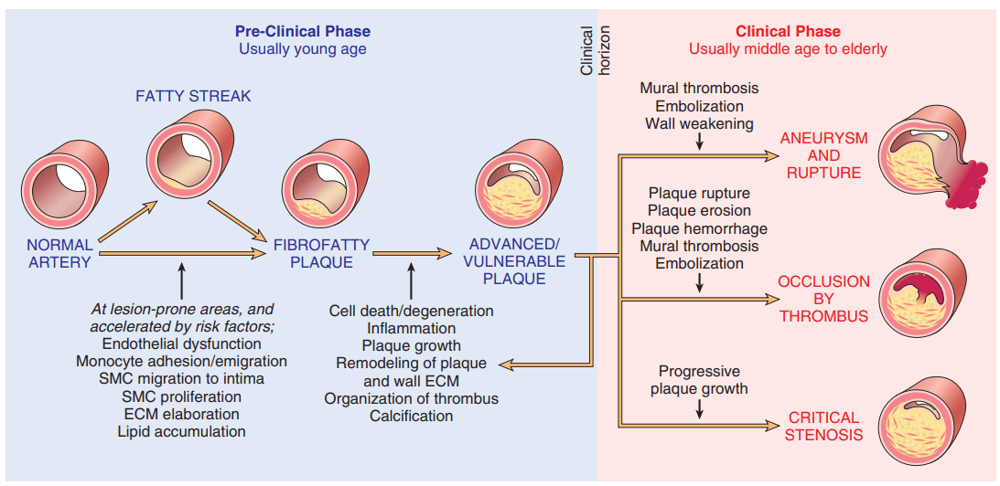
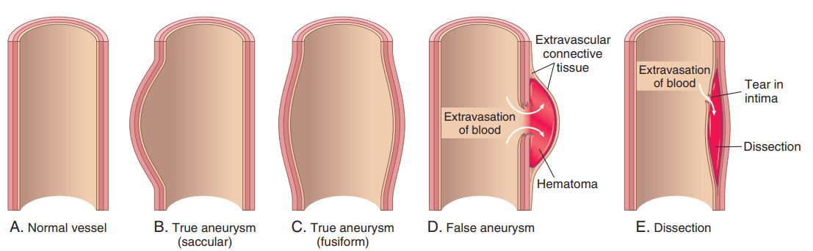

# VESSEL

[Arteriosclerosis](#arteriosclerosis)

[Aneurysm](#aneurysm)

[Vasculitis](#vasculitis)

[Varicose vein](#varicose-vein)

[Tumors](#tumors)

## Structure and function

## Intimal Thickening(neointima)

- 任何血管受損都會引起
- Endothelial dysfunction or loss
- 具有可逆性
- 平滑肌細胞增生、合成matrix
    - 受cytokines、growth factor、complement factor

## Arteriosclerosis

小動脈硬化，整個單元小於2mm的是小動脈

- Thickening and loss of elasticity of arterial wall
    -  Arteriolosclerosis
    -  Mönckeberg medial sclerosis
       -  Calcification of internal elastic membrane of muscular arteries
    - Atherosclerosis

### Arteriolosclerosis

小動脈硬化

- 血管壁變粗(基本上都發生在muscle layer)導致luminal變窄
- Hypertension or diabetes mellitus-related
- 種類
  - Hyaline arteriolosclerosis
  - Hyperplastic arteriolosclerosis

#### Hyaline arteriolosclerosis
- Aged, hypertension, diabetes mellitus
- 來自血液或平滑肌的ecm滲進小動脈管壁，造成管腔變載
- Homogenous, pink, hyaline thickening of arteriolar walls --> narrowing of lumen
- Leakage of plasma components across injured endothelial cells and increased extracellular matrix produced by smooth muscle cells

Chronic hypertension in kidney(常發生在腎臟)
- Diffuse renal ischemia
- Symmetric shrinkage of kidneys
- Benign nephrosclerosis

#### Hyperplastic arteriolosclerosis

血壓的高壓對血管造成的壓力，使血管壁增生

Severe or malignant hypertension
- systolic pressure > 200 mmHg
- diastolic pressure > 120 mmHg

Morphologic changes
- onionskin, concentric, laminated thickening of arteriolar wall made by smooth muscle cells resulting in narrowing of the lumen
- necrotizing arteriolitis

### Atherosclerosis

粥狀動脈硬化

- Intimal atheromatous or atherosclerotic(意思是 硬的) plaques
- Fibrous cap and atheroma(斑塊裡面會有很多鬆軟的物質，所以像粥)

#### Morphology
- Atheromatous plaque, 0.3-1.5 cm in diameter
- Principal components (**dynamic**)
  - cells: smooth muscle cells, macrophages, foam cells(主要來自macrophage，但書上表示smooth muscle也可能), T lymphocytes
  - extracellular matrix: collagen, elastic fiber, proteoglycans
  - intracellular and extracellular lipid
  - 在不同階段的百分比不一樣

#### Pathogenesis

**公認的原因 endothelial injuries**
1.  endothelial dysfunction, increased permeability, accumulation of lipoproteins
2.  adherence of monocytes and platelet, lipid accumulation
3.  migration and proliferation of smooth muscle cell
4.  accumulation of extracellular matrix and collagen
5.  thrombosis

剩下不到原本血管的百分之30的時候才會有血流減少的症狀，25以下的時候慢性缺血，或是造成破裂的碎片刺激造成血栓

Morphologic Events and Clinical Presentations of Atherosclerosis(附圖)

#### Major Risk Factors

Non-Modifiable
- genetic abnormalities
- family history
- increasing age
- male gender(一般認為oxytocin會保護血管壁)

modifiable
-  hyperlipidemia
-  hypertension
-  cigarette smoking
-  diabetes
-  inflammation (C-reactive protein)

Anatomic location
- elastic arteries: aorta, carotid, and iliac arteries
- muscular arteries: coronary, renal, popliteal arteries

Complicated lesions
- calcification, ulceration, thrombosis, hemorrhage, aneurysm

Clinical consequences
- chronic narrowing: ischemia of supply organs (heart, brain)
- acute plaque changes: rupture/fissuring, erosion/ulceration, hemorrhage
  - infarction (heart, brain, low legs, intestine)
  - thrombosis and embolism
- weakening of vascular wall: aneurysm or rupture

## Aneurysm(動脈瘤)

Localized abnormal dilation of a blood vessel or the wall of heart
- Character: true, false
- Shape: saccular, fusiform
- Type: atherosclerotic, syphilitic (leutic), infectious, aortic dissection

主動脈血液供應，外部是靠血管的血管，缺血之後就會壞死，血管壁變薄

Atherosclerotic Aneurysm
- Abdominal aorta below renal arteries
- Local inflammation induced destruction and excess extracellular matrix degradation
- Atheromatous ulcers covered by mural thrombi
- Complications
  - obstruction of branch
  - thromboembolism
  - pressure effect, rupture

Aortic Dissection
- Dissecting Hematoma
- Dissection of aortic media
- Intimal tear, false lumen, inlet, double barreled
- Causes
  - hypertension
  - cystic medial degeneration
  - injury
- Complications
  - rupture
  - hemorrhage
  - extension of dissection

TYPE
- A: 有包含到ascending aorta
  - A1: ascending、descending都有
  - A2: 只有ascending
- B: 只在descending aorta

## Vasculitis(arteritis, angiitis)

### Etiology
- infectious pathogens
- immune-mediated inflammation
  - immune complex deposition
  - anti-neutrophil cytoplasmic Ab (PR3-ANCA, MPO-ANCA)
  - anti-endothelial cell Ab
- physical and chemical injuries
- mechanical trauma
- toxins

### Giant Cell (Temporal) Arteritis

- > 50 y/o
- Arteries of head, vertebral arteries, ophthalmic artery, aorta
- Fever, fatigue, body weight loss, facial pain, headache
- Nodular thickenings with reduction of the lumen of affected vessels

- Granulomatous inflammation of the inner half of the media of aorta and main branches, mononuclear infiltrate, giant cells, fragmentation of internal elastic lamina
- Non-specific panarteritis with mixed inflammatory infiltrates

### Polyarteritis Nodosa

- Young adults
- Fever, malaise, body weight loss, hypertension, abdominal pain, muscle pain
- Small or medium-sized muscular arteries
- Kidneys, heart, liver, GI tract, pancreas, testes, skeletal muscle, nervous system, skin
- Ulcerations, infarcts, ischemic atrophy, hemorrhage
- Renal involvement is a major cause of death

- Transmural necrotizing inflammation, mixed inflammatory infiltrate, fibrinoid necrosis, luminal thrombosis, fibrous thickening (coexistence of all stages)
- Aneurysmal dilation, nodularity, vascular obstruction, infarction

### Kawasaki Disease

- Young children, infant (80% <4 y/o)
- Mucocutaneous Lymph Node Syndrome
- Fever, erythema, skin rash, cervical lymphadenopathy
- 20% develops cardiovascular sequelae
- Delayed-type hypersensitivity, polyclonal B cell activation ( anti-endothelial and smooth muscle cells autoantibodies)
- Transmural inflammation and necrosis of large, medium-sized and small arteries
- Aneurysm, thrombosis

## Varicose Vein(靜脈曲張)

- Obese, women, >50 y/o
- Abnormally dilated tortuous vein
- Prolonged increased intraluminal pressure, loss of support of vessel wall
- Persistent edema, stasis dermatitis, ulcerations
- Legs, esophagus, anorectum (hemorrhoid)

slide
- Venous stasis, congestion, edema, thrombosis
- Dilated, tortuous, elongated, scarred, intraluminal thrombosis
- Hypertrophy of smooth muscle, subintimal fibrosis, calcification (phlebosclerosis)

## Tumors

Blood vessels
- benign
  - hemangioma
  - pyogenic granuloma
  - glomus tumor
  - telangiectasia
- intermediate grade
  - hemangioendothelioma
  -  Kaposi sarcoma
- malignant
  - angiosarcoma
  - hemangiopericytoma

Lymphatics
- benign
  - lymphangioma
  - cystic hygroma
- malignant
  - lymphangiosarcoma
