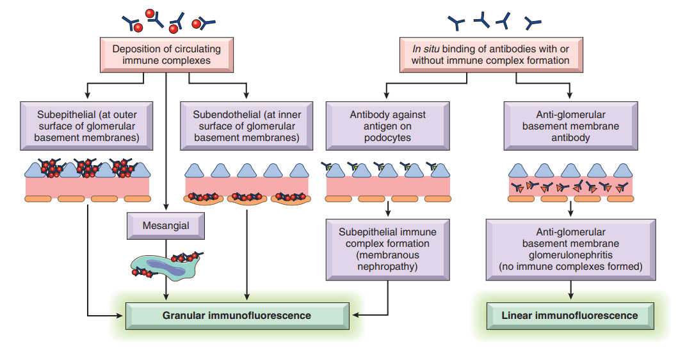

# Kidney and Its Collecting System

## Clinical Manifestations of Renal Diseases 

介紹詞彙

- Azotemia ： is an elevation of blood urea nitrogen and creatinine levels and usually reflects a decreased glomerular filtration rate(GFR)
- uremia： When azotemia gives rise to clinical manifestations and systemic biochemical abnormalities, it is termed uremia

- Nephrotic syndrome 的定義
  - Proteinuria: daily protein loss in the urine of 3.5 g or more in adults
  - Hypoalbuminemia: plasma albumin levels less than 3 g/dL
  - Generalized edema
  - Hyperlipidemia、lipiduria
  - 共同症狀:
    - a derangement in the capillary walls of the glomeruli that results in increased permeability to plasma proteins
- nephritic syndrome的定義
  - Hematuria: red cells and red cell casts in urine
  - Proteinuria: 有可能伴隨edema
  - Azotemia
  - Hypertension
  - 通常急性發作 且 is caused by inflammatory lesions of glomeruli.

## Glomerular Diseases

由幾個部分組成
- endothelial cell: 具fenestra、70-100nm直徑
-  glomerular basement membrane(GBM): 
   -  三層結構，中間的是很厚的、很多電子的中間層，依照順序是 lamina rara externa、 lamina densa、lamina rara interna
   - 具有collagen IV、 laminin, polyanionic proteoglycans, fibronectin, and several other glycoproteins
-  Podocytes: 貼在lamina rara externa外，有filtration slits，中間會由蛋白質nephrin 橋接起來(bridge)
-  Mesangial cells: 血管之間，支撐結構、分泌各種mediator

### Mechanisms of Glomerular Injury and Disease

- 腎臟本身的病變: primary glomerular diseases
- 從其他地方導致的病變:  secondary glomerular diseases 

Immune mechanisms underlie most types of primary glomerular diseases and many of the secondary glomerular diseases
1. 抗體抗原組合體被塞在glomerular的微血管壁
2.  antibodies reacting in situ within the glomerulus, either with fixed (intrinsic) glomerular antigens or with extrinsic molecules that are planted in the glomerulus

常見疾病

#### Minimal-Change Disease
- a relatively benign disorder
- the most frequent cause of the nephrotic syndrome in children
- characterized by glomeruli that have a normal appearance by light microscopy
- PATHO
  - unknown
  - hypothesis: circulating molecules injure podocytes
- CLIN
  - abrupt development of the nephrotic syndrome
  - proteinuria recurs in more than two-thirds of the initial responders

#### Focal Segmental Glomerulosclerosis(FSGS)
Focal segmental glomerulosclerosis (FSGS) is characterized by sclerosis of some (but not all) glomeruli that involves only a part of each affected glomerulus. 

primary或secondary
- HIV infection (HIV nephropathy). FSGS is seen in 5–10% of patients infected with HIV, but the incidence is decreasing with improved antiviral therapy.
- Heroin abuse (heroin nephropathy)
- Secondary to other forms of GN (e.g., IgA nephropathy)
- As a maladaptation to nephron loss (as discussed earlier)
- Inherited forms, including autosomal dominant forms associated with mutations in cytoskeletal proteins and podocin, both of which are required for the integrity of podocytes.

- PATHO
  - Injury to podocytes is thought to represent the initiating event of primary FSGS. 
- CLIN
  - important to distinguish FSGS from minimal-change disease

#### Membranous Nephropath
- Membranous nephropathy is characterized by subepithelial immunoglobulin-containing deposits along the GBM.
- 80% primary
- 剩下的secondary
  - Infections (chronic hepatitis B, syphilis, schistosomiasis,malaria)
  - Malignant neoplasms, particularly carcinoma of the lung and colon and melanoma
  - Autoimmune diseases, particularly systemic lupus erythematosus
  - Exposure to inorganic salts (gold, mercury)
  - Drugs (penicillamine, captopril, nonsteroidal antiinflammatory agents)

#### Membranoproliferative Glomerulonephritis
- MPGN is manifested histologically by alterations in the GBM and mesangium and by proliferation of glomerular cells.
- 過去分類分成兩類
  - type I: 80% 都是這種，
  - type II: 已改成命名為dense deposit disease，這邊不討論
- PATHO
  - caused by deposition of circulating  immune complexes or by in situ immune complex formation with a planted antigen. The inciting antigen is unknown
- CLIN
  -  50% of cases is the nephrotic syndrome
  -  The prognosis generally is poor

#### C3 Glomerulopathy
- dense deposit disease + C3 glomerulonephritis
- PATHO
  - Complement dysregulation due to acquired or hereditary abnormalities of the alternative pathway of complement activation is the underlying cause of dense deposit disease and C3 GN
- CLIN
  - poor prognosis
#### Acute Postinfectious (Poststreptococcal) Glomerulonephritis
- caused by glomerular deposition of immune complexes resulting in proliferation of and damage to glomerular cells and infiltration of leukocytes, especially neutrophils
- PATHO
  - immune complex disease
- CLIN
  - acute nephritic syndrome
#### IgA Nephropathy
- most common causes of recurrent microscopic or gross hematuria and is the most common glomerular disease revealed by renal biopsy worldwide
- the deposition of IgA in the mesangium
- PATHO
  - An abnormally glycosylated IgA1 immunoglobulin
- CLIN
  - often affects children and young adults
  - 

#### Hereditary Nephritis
- Hereditary nephritis refers to a group of glomerular diseases caused by mutations in genes encoding GBM proteins.
- Patho
  - The GBM is composed largely of type IV collagen, which is made up of heterotrimers of α3, α4, and α5 type IV collagen
  - manifestations of Alport syndrome
- CLIN
  - The majority of Alport syndrome patients have X-linked disease as a result of mutation of the gene on the X chromosome encoding the α5 chain of type IV collagen

#### Rapidly Progressive Glomerulonephritis(RPGN)
- the presence of crescents (crescentic GN) and in most cases appears to be immunologically mediated.
- PATHO
  - Anti-GBM antibody–mediated crescentic GN(Goodpasture disease)
    - linear deposits of IgG and C3 in the GBM
  - Immune complex–mediated crescentic GN
  - Pauci-immune type crescentic GN
    - the lack of anti-GBM antibodies or significant immune complex deposition

## Diseases Affecting Tubules and Interstitium

### Tubulointerstitial Nephritis
Tubulointerstitial nephritis (TIN) refers to a group of 
inflammatory kidney diseases that primarily involve the 
interstitium and tubules. 

#### Acute Pyelonephritis
- Acute pyelonephritis, a common suppurative inflammation of the kidney and the renal pelvis, is caused by bacterial infection. 
- PATHO
  - The principal causative organisms in acute pyelonephritis are enteric gram-negative bacilli
  - Ascending infection from the lower urinary tract is the most important and frequent route by which bacteria reach the kidney.
  - Incompetence of the vesicoureteral orifice, resulting in vesicoureteral reflux (VUR), is an important cause of ascending infection. 

- CLIN

#### Chronic Pyelonephritis and Reflux Nephropathy
- interstitial inflammation and scarring of the renal parenchyma are associated with grossly visible scarring and deformity of the pelvicalyceal system in patients with a history of UTI
- 可以被分成這兩種
  - chronic obstructive pyelonephritis
  - chronic reflux–associated pyelonephritis(Reflux Nephropathy)
- can be bilateral or unilateral
- CLIN
- 

#### Drug-Induced Tubulointerstitial Nephritis
- Acute drug-induced TIN occurs as an adverse reaction to any one of an increasing number of drugs
- most frequently with 
  - penicillins (methicillin, ampicillin)
  - other antibiotics (rifampin)
  - diuretics (furosemide)
  - proton pump inhibitors (omeprazole)
  - nonsteroidal antiinflammatory agents
  - numerous other drugs (phenindione, cimetidine, immune checkpoint inhibitors).
- PATHO
  - drugs act as haptens
  - caused by IgE- or T cell–mediated immune reactions to tubular cells or their basement membranes
- CLIN
  - 15 天後可能會 fever, eosinophilia, rash, and renal abnormalities. 

### Acute Tubular Injury/Necrosis
- Acute tubular injury (ATI) is a clinicopathologic entity characterized by damage to tubular epithelial cells and an acute decline in renal function
- 臨床上喜歡用acute tubular necrosis,但其實實際上幾乎沒有necrosis
- ATI is the most common cause of acute kidney injury and may produce oliguria (defined as urine output of <400 mL/day)
- 兩種分類
  - Ischemic ATI: most often the result of a period of inadequate blood flow to all or some peripheral organs such as the kidney, sometimes in the setting of marked hypotension and shock
  - Nephrotoxic ATI: variety of poisons
    - heavy metals (e.g., mercury)
    - organic solvents (e.g.,carbon tetrachloride)
    - drugs(gentamicin and other antibiotics, and radiographic contrast agents)
- PATHO
  - Proximal tubular epithelial cells are particularly sensitive to hypoxemia and also are vulnerable to toxins 
  - Ischemia causes numerous structural alterations in epithelial cell 之後就是一連串的各種病理
  - Tubular injury exacerbated by severe hemodynamic alterations，最多的是intrarenal vasoconstriction

## Diseases Involving Blood Vessels

#### Nephrosclerosis
- Nephrosclerosis refers to sclerosis of small renal arteries and arterioles that is strongly associated with hypertension
- PATHO
  - 基本上跟第10章有關，可以去看hypertension相關，但基本上是兩個結果
  - Medial and intimal thickening, as a response to hemodynamic changes, aging, genetic defects, or some combination of these
  - Hyalinization of arteriolar walls, caused by extravasation of plasma proteins through injured endothelium and by increased deposition of basement membrane matrix

#### Malignant Hypertension
- blood pressure usually greater than 200/120 mm Hg
- PATHO
  - long-standing hypertension -> fibrinoid necrosis 
  - Mitogenic factors from platelets + plasma -> intimal hyperplasia of vessels -> hyperplastic arteriosclerosis
- CLIN
  - papilledema, encephalopathy, cardiovascular abnormalities, and renal failure

#### Thrombotic Microangiopathies
- thrombotic microangiopathy (TMA) refers to lesions seen in various clinical syndromes characterized by 
  - microvascular thrombosis accompanied by microangiopathic hemolytic anemia
  - thrombocytopenia
  - renal failure
- PATHO
  - The major pathogenetic factors in the thrombotic microangiopathies are endothelial cell injury and platelet activation and aggregation
  - 三個比較重要的分類與原因
    - Shiga toxin–mediated HUS: As many as 75% of intestinal infection with Shiga toxin–producing E. coli, such as occurs following ingestion of contaminated ground meat (e.g., in hamburgers) and infections with Shigella dysenteriae type I
    - Atypical HUS: caused by acquired or hereditary abnormalities of factors that dampen activation of complement by the alternative pathway
    - TTP is caused by acquired or inherited deficiencies in ADAMTS13 

## Chronic Kidney Disease

Chronic kidney disease is a broad term that describes the  final common pathway of progressive nephron loss resulting from any type of kidney disease

- PATHO
  - glomerular hyperfiltration tends to compensate for decreased glomerular filtration rate resulting from the loss of nephrons
  - An increase in the rate of excretion of solutes per nephron via increased plasma concentrations, decreased tubular reabsorption, or increased tubular secretion helps to maintain homeostasis until the late stages of chronic kidney disease
- CLIN
  - Without treatment, the prognosis is poor; relentless progression to uremia and death is the rule

## Cystic Diseases of the Kidney

An emerging theme in the pathophysiology of the 
hereditary cystic diseases is that the underlying defect is 
in the cilia-centrosome complex of tubular epithelial 
cells.

### Simple Cysts

- generally innocuous lesions that occur as:
  - multiple or single cystic spaces of variable size
  -  1 to 5 cm in diameter
  -  translucent
  -  lined by a gray, glistening, smooth membrane
  -  filled with clear fluid. 
- common postmortem(屍檢) finding that has no clinical significance. 
- Acquired cystic kidney disease occurs in patients with end-stage renal disease

### Autosomal Dominant (Adult) Polycystic Kidney Disease
Adult polycystic kidney disease is characterized by multiple expanding cysts affecting both kidneys that ultimately destroy the intervening parenchyma. 

- PATHO
  - 85% to 90% of families, PKD1, on the short arm of chromosome 16, is the defective gene, PKD1 encodes a large (460-kDa) and complex cell membrane–associated protein called polycystin-1.
  - polycystin-1有很多extracelluar domain, transmembrane regions
  - 目前認為polycystin突變會導致cilia的mechanosensing缺失-> downstream signaling events involving calcium influx 
  - 剩下的則是PKD2突變，產生polycystin-2
  - polycystin-2認為是calcium-permeable membrane channel、 localized to cilia
  - PKD2與PKD1會形成heterodimers，所以兩個其中一個出事基本上影響差不多D
- CLIN
  - 成人通常40歲以後才會有症狀
  - 通常症狀為
    - flank pain or a heavy, dragging sensation
    - Intermittent gross hematuria
  - hypertension and urinary infection則是嚴重併發症

### Autosomal Recessive (Childhood) Polycystic Kidney Disease
- rare autosomal recessive disorder that is genetically distinct 
from adult polycystic kidney disease. 
- 大概 1 in 20,000 live births
- PKHD1 mutation，影響的是fibrocystin，作用是putative membrane receptor protein，但是功用未知

### Medullary Diseases With Cysts
分成兩類
- medullary sponge kidney
  - 較常見且無害
  - 有時和nephrolithiasis有關
- nephronophthisis-medullary cystic disease complex
  - 幾乎永遠與renal dysfunction有關
  - 通常從小時候開始 會變成chronic kidney disease
  - 四種變體
    - infantile
    - juvenile
    - adolescent nephronophthisis
    - medullary cystic disease
  - 至少有九個基因位置與autosomal recessive forms有關
- CLIN
  - polyuria and polydipsia

## Urinary Outflow Obstruction

### Renal Stones (Urolithiasis)
- PATHO
  - About 80% are composed of either calcium oxalate or calcium oxalate mixed with calcium phosphate
  - About 10% are composed of magnesium ammonium phosphate
  - Approximately 6% to 9% are either uric acid or cystine stones
  - In all cases, an organic matrix of mucoprotein is present that makes up about 2.5% of the stone by weight
  - The most important cause is increased urinary concentration of the stone’s constituents
  - Magnesium ammonium phosphate (struvite) stones 會發生在長期鹼尿患者
  - Gout and diseases involving rapid cell turnover(ex leukemias)會造成高尿酸最終導致uric acid stones
  -  Cystine stones與特定基因有關，跟uric acid stone一樣通常是酸性尿

### Hydronephrosis
Hydronephrosis refers to dilation of the renal pelvis and 
calyces

分類分成以下
- Congenital ，例如以下
  - atresia of the urethra
  - valve formations in either the ureter or urethra
  - an aberrant renal artery compressing the ureter
  - renal ptosis with torsion
  - kinking of the ureter
- Acquired，分成以下
  - Foreign bodies,例如
    - calculi or sloughed necroticpapillae
  - Proliferative lesions,例如
    - benign prostatic hyperplasia
    - carcinoma of the prostate
    - bladder tumors(papilloma and carcinoma)
    - contiguous malignant disease (retroperitoneal lymphoma, and carcinoma of the cervix or uterus)
  - Inflammatory lesions, 例如
    - prostatitis
    - ureteritis
    - urethritis
    - retroperitoneal fibrosis
  - Neurogenic, 例如
    - paralysis of the bladder following spinal cord damage
  - Normal pregnancy, in which hydronephrosis is mild and reversible

## Congenital and Developmental Anomalies
書中只針對特別的幾個作介紹
- Multicystic dysplasia
- Renal agenesis
- Hypoplasia

## Neoplasms 
### Neoplasms of the Kidney

- Carcinomas of the kidney are most common from the sixth to seventh decades, and men are affected about twice as commonly as women
#### Oncocytoma
Oncocytoma, a benign neoplasm that arises from the 
intercalated cells of collecting ducts, represents about 
10% of renal neoplasms

#### Renal Cell Carcinoma
- derived from the renal tubular epithelium
- located predominantly in the cortex
- These neoplasms represent 80% to 85% of all primary malignant neoplasms of the kidney and 2% to 3% of all cancers in adults.

#### Clear Cell Carcinomas
- the most common type, accounting for 65% of renal cell cancers. 
- most are sporadic, they also occur in familial forms or in association with von Hippel-Lindau (VHL) disease. 

#### Papillary Renal Cell Carcinoma
account for 10% to 15% of all renal cancers and are defined in part by their papillary growth pattern.

#### Chromophobe Renal Carcinoma
the least common form, representing 5% of all renal cell carcinomas