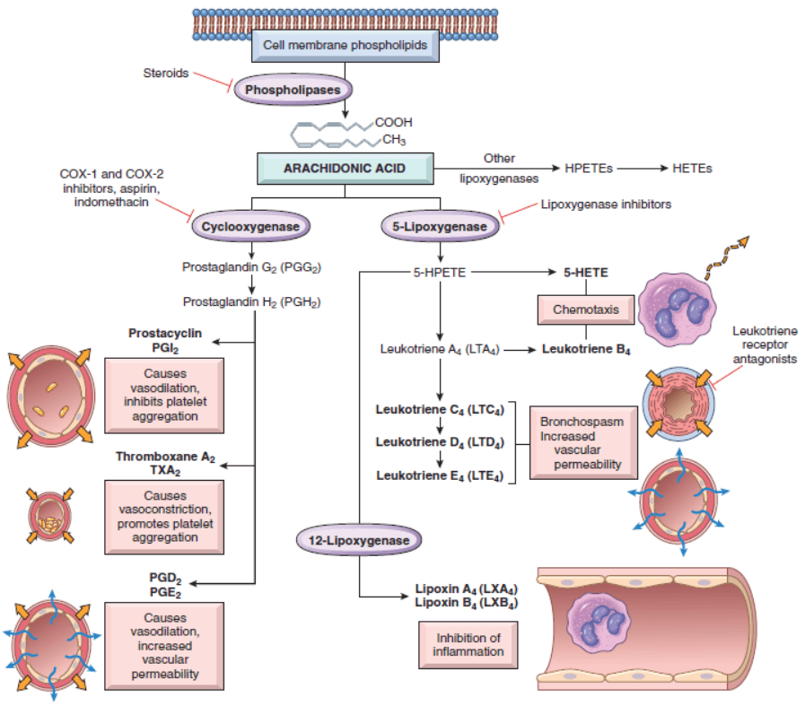

# Inflammation and Repair

## Overview of Inflammation: Definitions and General Features
Inflammation is a response of vascularized tissues to infections and tissue damage that brings cells and molecules of host defense from the circulation to the sites where they are needed, to eliminate the offending agents.

典型的發炎反應經過以下步驟
1. 侵犯物質(affending agent)在血管外(extravascular)組織被host cell和tissue辨認
2. Leukocyte和plasma proteins從循環中徵召到辨認到的位置
3. Leukocyte和protein活化然後一以破壞和清除侵入物質
4. 反應被控制和中止
5. 修復好組織

可以分為兩種：急性、慢性
急性
- 幾分鐘或小時就啟動，持續幾小時或幾天
- 特徵
  - 會造成液體、Plasma protein滲出造成水腫
  - emigration of leukocytes，尤其是neutrophil(又稱polymorphonuclear leukocytes)
慢性
- 急性清不完之後就會造成慢性，可以隨著急性發生或de novo
- 特徵：
  - 主要是lymphocyte和macrophages
  - 血管增生( proliferation of blood vessels)
  - 纖維化( fibrosis)

發炎由host cells被刺激所分泌的chemical mediator調控

The external manifestations of inflammation, often called its cardinal signs, are heat (calor in Latin), redness (rubor), swelling (tumor), pain (dolor), and loss of function (functio laesa).

in some situations, the inflammatory reaction becomes the cause of disease, and the damage it produces is its dominant feature.

Inflammation is terminated when the offending agent
is eliminated.
 
## Causes of Inflammation

- infection
- Tissue necrosis
- Foreign bodies
- Immune reaction

## Recognition of Microbes and Damaged Cells
The first step in inflammatory responses is the recognition
of microbes and necrotic cells by cellular receptors
and circulating proteins

- Cellular receptors for microbe: EX:TLR，偵測PAMP(pathogen-associated molecular patterns)
- Sensors of cell damage，偵測DAMP(damage-associated molecular patterns)，像是uric acid(DNA分解產物)、ATP(粒線體受損)、K+濃度降低(細胞膜受損)、DNA(核受損)，之後receptor啟動inflammasome(一堆蛋白質的complex)，產生IL1
- Circulating proteins，許多plasma proteins recognize microbes用來偵測blood-borne microbe，EX:mannose binding lectin偵測完就啟動補體，或是collectins會結合後促進phagocytosis

## Acute Inflammation

由三個部分組成
1. dilation od small vessels-> increase blood flow
2. increased permeability of the microvasculature -> enabling plasma proteins and leukocytes to leave the circulation
3. emigration of the leukocytes from the microcirculation, their accumulation in the focus of injury, and their activation to eliminate the offending agent 

### Reactions of Blood Vessels in Acute Inflammation

The vascular reactions of acute inflammation consist of changes in the flow of blood and the permeability of vessels, both designed to maximize the movement of plasma proteins and leukocytes out of the circulation and into the site of infection or injury.

名詞解釋
exudation:血管裡的東西跑到間質或體腔
exudate: 發炎跑出來的液體。很高蛋白質濃度
transudate: 透明，低蛋白質濃度，高血壓或滲透壓不平衡導致
edema: 水腫，exudate或transudate都有可能
Pus: purulent excudate，膿，充滿leukocyte、debris of dead cell

Changes in Vascular Flow and Caliber
- Vasodilation: 很多mediator可以調控，notably histamine，促進小動脈平滑肌。increased blood flow
- vasodilation完會導致血管通透度上升，exudate增加
- 血管流失液體+血管擴張導致血流速度降低，red cell堆積，增加血管viscosity
  - 造成stasis of blood flow
  - vascular congestion: engorgement of small vessels jammed with slowly moving red cells
  - localized redness (erythema)
- blood leukocytes, principally neutrophils，堆積在血管上皮，同時受傷組織啟動mediator然後增加adhesion

Increased Vascular Permeability (Vascular Leakage)
- Retraction of endothelial cells: 由histamine, bradykinin,leukotrienes, and other chemical mediators啟動，通常15-30分鐘就會啟動，也不會維持太久
- Endothelial injury: endothelial cell necrosis and detachment，由燒傷或toxins導致，會維持很久(hours or days)，neutrophils會接在endothelial上進一步惡化
- transcytosis，增加東西穿過endothelial，實驗模型裡有，針對特定分子(EX: VEGF)

Responses of Lymphatic Vessels and Lymph Nodes
- 協助把體外液回收，有可能會造成二次發炎(lymphangitis)，淋巴結draining但細胞腫大(lymphadenitis)
- 如果皮膚傷口附近有red streak會是lymphangitis的特徵

### Leukocyte Recruitment to Sites of Inflammation
Leukocytes that are recruited to sites of inflammation perform the key function of eliminating the offending agents.

The journey of leukocytes from the vessel lumen to the tissue is a multistep process that is mediated and controlled by adhesion molecules and cytokines.

Leukocyte Adhesion to Endothelium
- Red cells, being smaller, tend to move faster than the larger white cells ->red cells are confined to the central axial column, and leukocytes are pushed out toward the wall of the vessel
- 等到流速降低(stasis)，hemodynamic conditions change (wall shear stress decreases)，leukocyte 靠近上皮(margination)
- 在表皮上不斷接合又斷掉連結，造成滾動(rolling)，最終牢固接合，沖不走

過程中有主要涉及兩個cell type的adhesion molecule，會被cytokine強化
- Selectins: 負責滾動的弱連結，外面有醣(名字lectin的部分)，三個小成員
  - E-selectin，又叫CD62E，會在內皮表現
  - P-selectin，又叫CD62P，在血小板、內皮表現
  - L-selectin，又叫CD62L，大部分leukocytes
  - 結構sialic acid-containing oligosaccharides bound on glycoprotein backbone會跟selectin接合
  - 需要的時候才會表現出來或移到血管側的內皮
- Integrins: 負責扎實的連結，leukocyte surface protein一種
  - 在滾動時會受到內皮上的chemokine活化，聚在一起變hogh affinity form
  - TNF和IL1會提高表現量
  - 內皮細胞上的ICAM1會跟LFA-1(integrins leukocyte function–associated antigen-1，CD11aCD18)、Mac-1(CD11bCD18)接合，VCAM-1則跟VLA-4接合

Leukocyte Migration Through Endothelium
- leukocyte從內皮跑出來的過程為transmigration
- PECAM-1(CD31)會協助過程

Chemotaxis of Leukocytes
- 在組織之間穿梭移動到受傷的位置稱為chemotaxi
- 會受到這些物質吸引
  - Bacterial products, particularly peptides with Nformylmethionine termini
  - Cytokines, especially those of the chemokine family
  - Components of the complement system, particularly C5a
  - Products of the lipoxygenase pathway of arachidonic acid (AA) metabolism, particularly leukotriene B4 (LTB4)

The nature of the leukocyte infiltrate varies with the age of the inflammatory response and the type of stimulus.

Agents that block TNF, one of the major cytokines in leukocyte recruitment, are among the most successful therapeutics ever developed for chronic inflammatory diseases

### Phagocytosis and Clearance of the Offending Agent
Recognition of microbes or dead cells induces several
responses in leukocytes that are collectively called leukocyte
activation

#### **Phagocytosis**

Phagocytosis involves three sequential steps: 
1. recognition and attachment of the particle to be ingested by the leukocyte
2.  engulfment, with subsequent formation of a phagocytic vacuole
3.  killing or degradation of the ingested material

triggered by
- activation of phagocytes by microbes
- necrotic debris
- various mediators.

Recognition by Phagocytic Receptors
- macrophage mannose receptor: 可以接terminal mannose或fucose residues of glycoproteins and glycolipids，這幾個醣通常用在細菌細胞壁，人類的則通常是terminal sialic acid or N-acetylgalactosamine
- Scavenger receptors: 接然後ingest LDL或是一些microbes，
- phagocytosis會很大程度被opsonins槍化，主要有IgG、C3b補體產物跟特定的plasma lectin

Engulfment
- 接合後會產生偽足(pseudopods)包住產生phagosome，然後跟lysosomes結合，形成phagolysosome

Intracellular Destruction of Microbes and Debris

The killing of microbes and the destruction of ingested materials are accomplished by reactive oxygen species (ROS, also called reactive oxygen intermediates), reactive nitrogen species, mainly derived from nitric oxide (NO),and lysosomal enzymes

**ROS**
- ROS are produced by the rapid assembly and activation of a multicomponent enzyme, phagocyte oxidase (also called NADPH oxidase)
- oxidizes NADPH (reduced nicotinamide-adenine dinucleotide phosphate) and, in the process, reduces oxygen to the superoxide anion 
- 在neutrophiol中與phagocytosis高度相關，稱為respiratory burst
- H2O2 is not able to kill microbes efficiently by itself.
- myeloperoxidase (MPO)，可以用halide(Cl-)將H2O2變OCl2
- OCl2可以藉由halogeneration(Cl跟一堆物質接合)或oxidative清除
- H2O2也可以變OH-清除物質

一般細胞可以透過三個東西防ROS
1. superoxide dismutase
2. catalase
3. glutathione peroxidase

不能製造ROS的免疫疾病: chronic granulomatous disease

**Nitric Oxide**
- NOS產生
  - endothelial (eNOS)
  - neuronal (nNOS)
  - inducible (iNOS)
- NO與O2.形成ONOO.，超高活性的自由基

**Granule Enzymes and Other Proteins**

Neutrophils and monocytes contain granules packed with enzymes and anti-microbial proteins that degrade microbes and dead tissues and may contribute to tissue damage.
分兩類
- specific(or secondary) granule: 包含lysozyme,collagenase, gelatinase, lactoferrin, plasminogen activator, histaminase, and alkaline phosphatase.
- azurophil(or primary) granules: 包含MPO, bactericidal factors (such as defensins), acid hydrolases, and a variety of neutral proteases (elastase, cathepsin G, nonspecific collagenases, proteinase 3)

Neutrophil Extracellular Traps

Neutrophil extracellular traps (NETs) are extracellular fibrillar networks that concentrate anti-microbial substances at sites of infection and prevent the spread of the microbes by trapping them in the fibrils.

### Leukocyte-Mediated Tissue Injury
- normal defense reaction against infectious microbes
- When the inflammatory response is inappropriately directed against host tissues
- When the host “hyper-reacts” against usually harmless environmental substances, as in allergic diseases

Leukocytes damage tissues by releasing injurious molecules.

### Other Functional Responses of Activated Leukocytes
### Termination of the Acute Inflammatory Response
## Mediators of Inflammation

The mediators of inflammation are the substances that initiate and regulate inflammatory reactions.

- Mediators may be produced locally by cells at the site of inflammation, or may be derived from circulating inactive precursors that are activated at the site of inflammation.
- The major cell types that produce mediators of acute inflammation are tissue macrophages, dendritic cells, and mast cells
- Active mediators are produced only in response to various molecules that stimulate inflammation, including microbial products and substances released from necrotic cells.
- Most of the mediators are short-lived
- One mediator can stimulate the release of other mediators

### Vasoactive Amines: Histamine and Serotonin

The two major vasoactive amines, so named because they have important actions on blood vessels, are histamine and serotonin.

受到這些刺激的時候會釋放
1. physical injury, such as trauma, cold, or heat, by unknown mechanisms
2. binding of antibodies to mast cells
3. products of complement called anaphylatoxins(C3a and C5a)

Histamine causes dilation of arterioles and increases the permeability of venules.

Serotonin (5-hydroxytryptamine) is a preformed vasoactive mediator present in platelets and certain neuroendocrine cells,

### Arachidonic Acid Metabolites
The lipid mediators prostaglandins and leukotrienes are produced from arachidonic acid present in membrane phospholipids, and they stimulate vascular and cellular reactions in acute inflammation.
- Mechanical, chemical, and physical stimuli or other mediators (e.g., C5a) trigger the release
- arachidonic acid is rapidly converted to bioactive mediators. These mediators, also called eicosanoids 

**Prostaglandins**
- produced by mast cells, macrophages, endothelial cells, and many other cell types
- involved in the vascular and systemic reactions of inflammation
- generated by the actions of two cyclooxygenases called COX-1 and COX-2
- Prostaglandins are named based on structural features coded by a letter (e.g., PGD, PGE, PGF, PGG, and PGH) and a subscript numeral (e.g., 1, 2), which indicates the number of double bonds in the compound.
- 重要的幾個: PGE2, PGD2, PGF2a, PGI2 (prostacyclin), and TXA2 (thromboxane A2)
- PGD2: mast cell分泌最主要的prostaglandin
  - causes vasodilation and increases the permeability of postcapillary venules
  - chemoattractant for neutrophils
- TXA2: Platelets製造的主要
  - potent platelet-aggregating agent and vasoconstrictor
- PGI2(prostacyclin)、stable end product PGF1a: 
  - vasodilator and a potent inhibitor of platelet aggregation, and thus serves to prevent thrombus formation on normal endothelial cells
- prostaglandins are involved in the pathogenesis of pain and fever
  - PGE2 makes the skin hypersensitive to painful stimuli,

**Leukotrienes**

are produced in leukocytes and mast cells by the action of lipoxygenase and are involved in vascular and smooth muscle reactions and leukocyte recruitment.

**Lipoxins**

Lipoxins also are generated from arachidonic acid by the lipoxygenase pathway, but unlike prostaglandins and leukotrienes, the lipoxins suppress inflammation by inhibiting the recruitment of leukocytes.

**Pharmacologic Inhibitors of Prostaglandins and Leukotrienes**
- Cyclooxygenase inhibitors
- Lipoxygenase inhibitors
- Corticosteroids
- Leukotriene receptor antagonists

### Cytokines and Chemokines
Cytokines are proteins secreted by many cell types (principally activated lymphocytes, macrophages, and dendritic cells, but also endothelial, epithelial, and connective tissue cells) that mediate and regulate immune and inflammatory reactions.

**Tumor Necrosis Factor and Interleukin-1**

TNF and IL-1 serve critical roles in leukocyte recruitment by promoting adhesion of leukocytes to endothelium and their migration through vessels
- Endothelial activation
- Activation of leukocytes and other cells
- Systemic acute-phase response
- TNF regulates energy balance by promoting lipid and protein catabolism and by suppressing appetite

TNF antagonists have been remarkably effective in the treatment of chronic inflammatory diseases

**Chemokines**

Chemokines are a family of small (8–10 kD) proteins that act primarily as chemoattractants for specific types of leukocytes.
- C-X-C chemokines
  - one amino acid residue separating the first two of the four conserved cysteines
  - act primarily on neutrophils
  - EX: IL-8 (nowcalled CXCL8)
- C-C chemokines
  - first two conserved cysteine residues adjacent
  - EX monocyte chemoattractant protein (MCP-1, CCL2), eotaxin (CCL11), and macrophage inflammatory protein-1α (MIP-1α, CCL3)
- C chemokines 
  - lack the first and third of the four conserved cysteines
  - relatively specific for lymphocytes
  - e.g., lymphotactin,XCL1

### Complement System
The complement system is a collection of soluble proteins and their membrane receptors that function mainly in host defense against microbes and in pathologic inflammatory reactions.

### Other Mediators of Inflammation
1. Platelet-Activating Factor
   - phospholipid-derived mediator
   - caused platelet aggregation
2. Products of Coagulation
   - protease-activated receptors (PARs)
3. Kinins
   - Bradykinin increases vascular permeability
   - causes contraction of smooth muscle, dilation of blood vessels, and pain when injected into the skin.
4. Neuropeptides
   - secreted by sensory nerves and various leukocytes
   - including substance P and neurokinin A

## Morphologic Patterns of Acute Inflammation

The morphologic hallmarks of acute inflammatory reactions are dilation of small blood vessels and accumulation of leukocytes and fluid in the extravascular tissue.

- accumulation of extravascular fluid rich in plasma proteins (edema)
- the redness (rubor), warmth (calor), and swelling (tumor)
- Leukocytes causing tissue damage and loss of function (functio laesa)

### Serous Inflammation
- Serous inflammation is marked by the exudation of cellpoor fluid
- effusion

### Fibrinous Inflammation
- A fibrinous exudate develops when the vascular leaks are large or there is a local procoagulant stimulus

### Purulent (Suppurative) Inflammation, Abscess
- Purulent inflammation is characterized by the production of pus, an exudate consisting of neutrophils, theliquefied debris of necrotic cells, and edema fluid.

### Ulcers
An ulcer is a local defect, or excavation, of the surface of an organ or tissue that is produced by the sloughing (shedding) of inflamed necrotic tissue

## Outcomes of Acute Inflammation
typically have one of three outcomes
- Complete resolution
- Healing by connective tissue replacement (scarring, or fibrosis)
- Progression of the response to chronic inflammation

## Chronic Inflammation
- Chronic inflammation is a response of prolonged duration (weeks or months) in which inflammation, tissue injury, and attempts at repair coexist, in varying combinations

### Causes of Chronic Inflammation
- Persistent infections，delayed-type hypersensitivity，sometimes granulomatous inflammation
- Hypersensitivity diseases
- Prolonged exposure to potentially toxic agents, either exogenous or endogenous

### Morphologic Features
- Infiltration with mononuclear cells(macrophages, lymphocytes, and plasma cells)
- Tissue destruction
- Attempts at healing(angiogenesis、fibrosis)

### Cells and Mediators of Chronic Inflammation

**Role of Macrophages**

The dominant cells in most chronic inflammatory reactions are macrophages, which contribute to the reaction by secreting cytokines and growth factors that act on various cells, by destroying foreign invaders and tissues, and by activating other cells, notably T lymphocytes.

There are two major pathways of macrophage activation,called classical and alternative
- Classical macrophage activation
- Alternative macrophage activation

The products of activated macrophages eliminate injurious agents such as microbes and initiate the process of repair, but are also responsible for much of the tissue injury in chronic inflammation.
- Macrophages secrete mediators of inflammation
- display antigens to T lymphocytes and respond to signals from T cells

**Role of Lymphocytes**

Microbes and other environmental antigens activate T and B lymphocytes, which amplify and propagate chronic inflammation.

By virtue of their ability to secrete cytokines, CD4+ T lymphocytes promote inflammation and influence the nature of the inflammatory reaction

- TH1 cells produce the cytokine IFN-γ -> activates macrophages by the classical pathway
- TH2 cells secrete IL-4, IL-5, and IL-13 -> recruit and activate eosinophils and are responsible for the alternative pathway of macrophage activation
- TH17 cells secrete IL-17 and other cytokines -> induce the secretion of chemokines responsible for recruiting neutrophils into the reaction

**Other Cells in Chronic Inflammation**

- Eosinophils are abundant in immune reactions mediated by IgE and in parasitic infections
- Mast cells  participate in both acute and chronic inflammatory reactions
- Although neutrophils are characteristic of acute inflammation, many forms of chronic inflammation, lasting for months, continue to show large numbers of neutrophils

**Granulomatous Inflammation**

Granulomatous inflammation is a form of chronic inflammation characterized by collections of activated macrophages, often with T lymphocytes, and sometimes associated with central necrosis

two types of granulomas
- Immune granulomas
- Foreign body granulomas

Tuberculosis is the prototype of a granulomatous disease caused by infection and should always be excluded as the cause when granulomas are identified

## Systemic Effects of Inflammation
Inflammation, even if it is localized, is associated with cytokine-induced systemic reactions that are collectively called the acute-phase response

acute-phase
- Fever, characterized by an elevation of body temperature, usually by 1° to 4°C
- Acute-phase proteins are plasma proteins
  - Three of the best-known of these proteins are C-reactive protein (CRP), fibrinogen, and serum amyloid A (SAA) protein
- Leukocytosis
- Other manifestations of the acute-phase response include increased heart rate and blood pressure; decreased sweating,rigors (shivering), chills (search for warmth), anorexia, somnolence, and malaise

## Tissue Repair

### Overview of Tissue Repair

Repair of damaged tissues occurs by two types of reactions: regeneration by proliferation of residual (uninjured) cells and maturation of tissue stem cells, and the deposition of connective tissue to form a scar

- Regeneration
  - replace the damaged components and essentially return to a normal state
- Connective tissue deposition (scar formation)
  - a process that may result in formation of a scar
  - If fibrosis develops in a tissue space occupied by an inflammatory exudate, it is called organization

### Cell and Tissue Regeneration

The regeneration of injured cells and tissues involves cell proliferation, which is driven by growth factors and is critically dependent on the integrity of the extracellular matrix, and by the development of mature cells from stem cells

**Cell Proliferation: Signals and Control Mechanisms**

- Several cell types proliferate during tissue repair
  - remnants of the injured tissue
  - vascular endothelial cells
  - fibroblasts
- The ability of tissues to repair themselves is determined, in part, by their intrinsic proliferative capacity.
- labile tissues
  - constantly being lost and must be continually replaced by new cell
  - EX 
    - hematopoietic cells in the bone marrow
    - many surface epithelia
    - the cuboidal epithelia of the ducts draining exocrine organs
    - the columnar epithelium of the gastrointestinal tract, uterus, and fallopian tubes
    - the transitional epithelium of the urinary tract
- stable tissues
  - normally in the G0 stage
  - capable of dividing in response to injury or loss of tissue mass
    - the parenchyma of most solid organs, such as liver, kidney, and pancreas
    - Endothelial cells
    - fibroblasts
    - smooth muscle cells
- permanent tissues
  - terminally differentiated nonproliferative cells
  - irreversible and results in a scar
    - majority of neurons
    - cardiac muscle cells.

**Mechanisms of Tissue Regeneration**

- In epithelia of the intestinal tract and skin, injured cells are rapidly replaced by proliferation of residual cells and differentiation of cells derived from tissue stem cells
- Tissue regeneration can occur in parenchymal organs whose cells are capable of proliferation, but with the exception of the liver, this is usually a limited process.

**Liver Regeneration**

The human liver has a remarkable capacity to regenerate, as demonstrated by its growth after partial hepatectomy

Regeneration of the liver occurs by two major mechanisms: proliferation of remaining hepatocytes and repopulation from progenitor cells
- Proliferation of hepatocytes following partial hepatectomy
- Liver regeneration from progenitor cells

### Repair by Scarring

If repair cannot be accomplished by regeneration alone, it occurs by replacement of the injured cells with connective tissue, leading to the formation of a scar, or by a combination of regeneration of some residual cells and scar formation.

Steps
1. Within minutes after injury, a hemostatic plug comprised of platelets is formed
2. Inflammation: the typical acute and chronic inflammatory responses
   1. Macrophages are the central cellular players in the repair process
   2. M1 macrophages clear microbes and necrotic tissue and promote inflammation in a positive feedback loop
   3. M2 macrophages produce growth factors that stimulate the proliferation of many cell types in the next stage of repair
3. Cell proliferation
   1. Epithelial cells respond to locally produced growth factors and migrate over the wound to cover it.
   2. Endothelial and other vascular cells form vessel
   3. Fibroblasts
   4. 上述三個形成granulation tissue
4. Remodeling

**Angiogenesis**

Angiogenesis is the process of new blood vessel development from existing vessels

factors
- Growth factors
  - VEGFs, mainly VEGF-A: endothelial cells
  - Fibroblast growth factors (FGFs), mainly FGF-2: endothelial cells
  - PDGF recruits smooth muscle cells
  - TGF-β suppresses endothelial proliferation and migration
- Notch signaling: VEGF
- ECM proteins
- Enzymes in the ECM, notably the matrix metalloproteinases(MMPs)

**Activation of Fibroblasts and Deposition of Connective Tissue**

The laying down of connective tissue occurs in two steps:
1. migration and proliferation of fibroblasts into the site of injury and 
2. deposition of ECM proteins produced by these cells.

TGF-β is the most important cytokine for the synthesis and deposition of connective tissue proteins

**Remodeling of Connective Tissue**

After the scar is formed, it is remodeled to increase its strength and contract it

### Factors That Impair Tissue Repair

- Infection: prolongs inflammation and potentially increases the local tissue injury.
- Diabetes compromises tissue repair 
- Nutritional status 
- Glucocorticoids (steroids): they inhibit TGF-β production and diminish fibrosis
- Mechanical factors
- Poor perfusion
- Foreign bodies such as fragments of steel, glass, or even bone impede healing
- The type and extent of tissue injury affects the subsequent repair. 
- The location of the injury and the character of the tissue in which 

### Clinical Examples of Abnormal Wound Healing and Scarring

Defects in Healing: Chronic Wounds
- Venous leg ulcers
  - develop most often in elderly people as a result of chronic venous hypertension
  - Deposits of iron pigment (hemosiderin) are common, resulting from red cell breakdown
  - These ulcers fail to heal because of poor delivery of oxygen to the site of the ulcer
- Arterial ulcers 
  - individuals with atherosclerosis of peripheral arteries, especially associated with diabetes
- Pressure sores
  - caused by prolonged compression of tissues against a bone
- Diabetic ulcers
  - affect the lower extremities,particularly the feet
  - result of small vessel disease causing ischemia,neuropathy, systemic metabolic abnormalities, and secondary infections.

Excessive Scarring

Excessive formation of the components of the repair process can give rise to hypertrophic scars and keloids.
