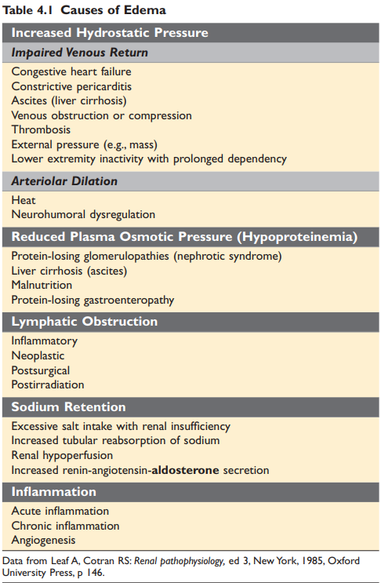
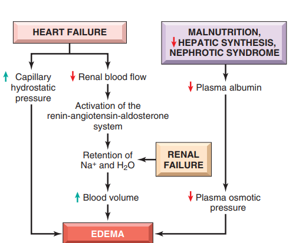
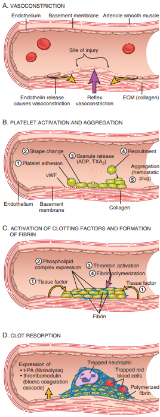
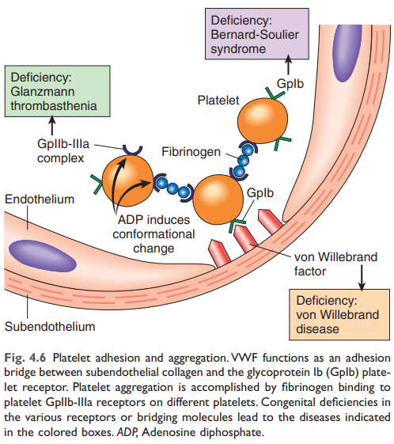
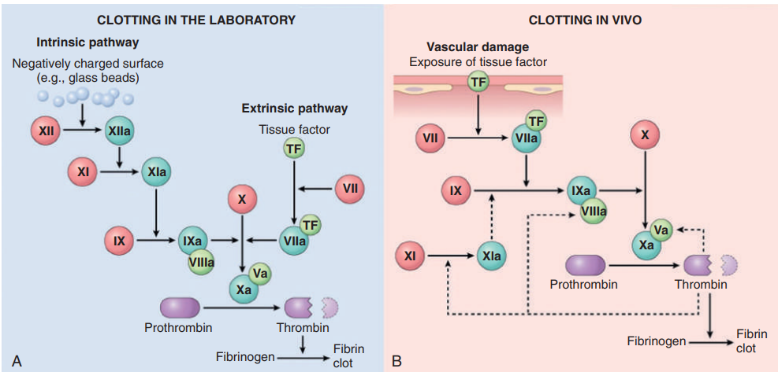
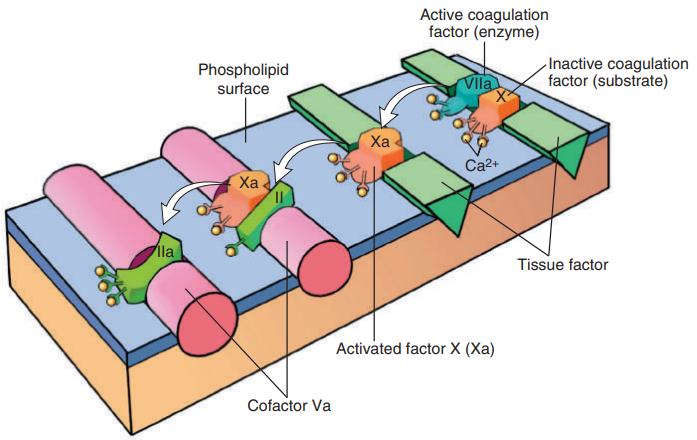
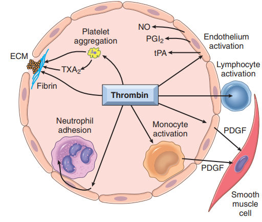
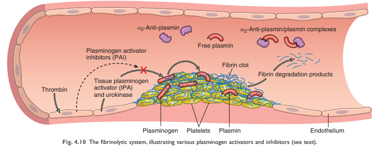
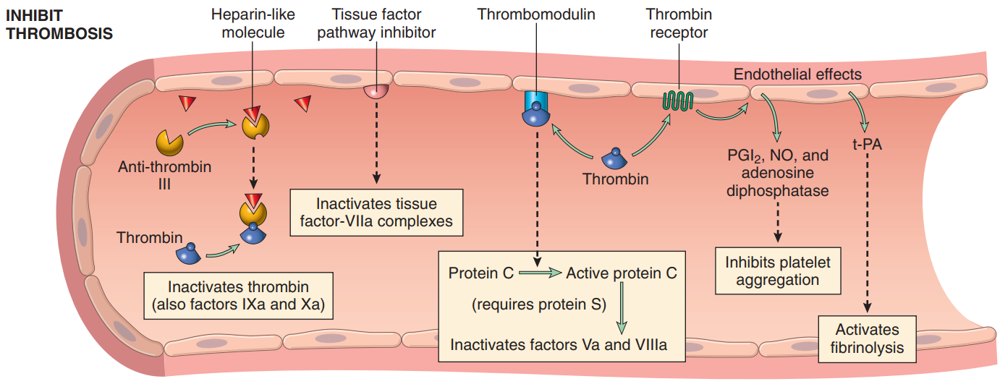

# Hemodynamic Disorders,Thromboembolism, and Shock

## Hyperemia and Congestion

Hyperemia:
- active
- arteriolar dilation and increased blood inflow, as occurs at sites of inflammation or in exercising skeletal muscle
- redder than normal

Congestion
- passive
- from impaired outflow of venous blood from a tissue. can be systemically
- abnormal blue-red color (cyanosis)

### Edema

### Increased Hydrostatic Pressure

Increases in hydrostatic pressure are mainly caused by disorders that impair venous return

- most commonly in congestive heart failure
- triggering the renin-angiotensin-aldosterone axis and inducing sodium and water retention --> vicious  cycle of fluid retention, increased venous hydrostatic pressures, and worsening edema ensues

### Reduced Plasma Osmotic Pressure

Reduction of plasma albumin concentrations leads to decreased colloid osmotic pressure of the blood and loss of fluid from the circulation

- Nephrotic syndrome is the most important cause of albumin loss from the blood
- low albumin levels lead in a stepwise fashion  to edema, reduced intravascular volume, renal hypoperfusion, and secondary hyperaldosteronism

### Lymphatic Obstruction

Edema may result from lymphatic obstruction that compromises resorption of fluid from interstitial spaces.

- filariasis(寄生蟲) -->lower extremity and external genitalia(elephantiasis 象腳病)
- the characteristic finely pitted appearance of the skin of the affected breast is called peau d’orange

### Sodium and Water Retention

- Excessive retention of salt (and its obligate associated  water) can lead to edema by increasing hydrostatic pressure
- a wide variety of diseases that compromise renal function

## Hemorrhage
Hemorrhage, defined as the extravasation of blood from vessels, is most often the result of damage to blood vessels or defective clot formation

分類
- external or accumulate within a tissue as a hematoma
- Large bleeds into body cavities are described variously according to location—hemothorax, hemopericardium, hemoperitoneum, or hemarthrosis (in joints)
- occasionally result in jaundice from the massive breakdown of red cells and hemoglobin
- Petechiae are minute (1 to 2 mm in diameter) hemorrhages into skin, mucous membranes, or serosal surfaces 
- Purpura are slightly larger (3 to 5 mm) hemorrhages, cause 通常跟petechiae一樣
- Ecchymoses are larger (1 to 2 cm) subcutaneous hematomas

## Hemostasis and Thrombosis
### Normal Hemostasis
Hemostasis is a precisely orchestrated process involving platelets, clotting factors, and endothelium that occurs at the site of vascular injury and culminates in the formation of a blood clot, which serves to prevent or limit the extent of bleeding

It should be emphasized that endothelial cells are central regulators of hemostasis; the balance between the anti-thrombic and prothrombotic activities of endothelium determines whether thrombus formation, propagation, or dissolution occurs

**PLATELET**

Platelets play a critical role in hemostasis by forming the primary plug that initially seals vascular defects and by providing a surface that binds and concentrates activated coagulation factors

platelet activation: Platelets rapidly change shape + Secretion of granule contents

- Platelet adhesion is mediated largely via interactions with vWF
- Platelets rapidly change shape
- Secretion (release reaction) of granule contents
  - Thrombin activates platelets through a special type of G-protein–coupled receptor referred to as a protease-activated receptor (PAR)
  - thus, platelet activation and ADP release begets additional rounds of platelet activation, a phenomenon referred to as recruitment.
  - Activated platelets produce the prostaglandin thromboxane A2 (TXA2), a potent inducer of platelet aggregation
  - Aspirin inhibits platelet aggregation and produces a mild bleeding defect by inhibiting cyclooxygenase
- Platelet aggregation follows their activation
  - Predictably, inherited deficiency of GpIIb-IIIa results in a bleeding disorder called Glanzmann thrombasthenia
  - converts fibrinogen into insoluble fibrin -> cementing the platelets in place and creating the definitive secondary hemostatic plug

**Coagulation Cascade**
The coagulation cascade is a series of amplifying enzymatic reactions that lead to the deposition of an insoluble fibrin clot

- prothrombin time (PT) assay assesses the function of the proteins in the extrinsic pathway (factors VII, X, V, II (prothrombin), and fibrinogen)
- The partial thromboplastin time (PTT) assay screens the function of the proteins in the intrinsic pathway (factors XII, XI, IX, VIII, X, V, II, and fibrinogen)

thrombin is the most important

-  Thrombin directly converts soluble fibrinogen into fibrin monomers that polymerize into an insoluble fibril, and also amplifies the coagulation process, not only by activating factor XI, but also by activating two critical cofactors: factors V and VIII. It also stabilizes the secondary hemostatic plug by activating factor XIII, which covalently crosslinks fibrin.
- Platelet activation. Thrombin is a potent inducer of platelet activation and aggregation through its ability to activate PARs, thereby linking platelet function to coagulation.
- Proinflammatory effects. PARs also are expressed on inflammatory cells, endothelium, and other cell types, and activation of these receptors by thrombin is believed to mediate proinflammatory effects that contribute to tissue repair and angiogenesis.
- Anti-coagulant effects. Remarkably, through mechanisms described later, on encountering normal endothelium, thrombin changes from a procoagulant to an anticoagulant; this reversal in function prevents clots from extending beyond the site of the vascular injury.

Factors That Limit Coagulation(控制在患部)

- simple dilution
- the requirement for negatively charged phospholipids(platelet提供)
- Activation of the coagulation cascade -> motion a fibrinolytic cascade -> limits the size of the clot

fibrinolytic

- plasmin: breaks down fibrin and interferes with its polymerization
- elevated level of breakdown products of fibrinogen: mainly D-dimers
- Plasmin is generated by plasminogen
  - XII–dependent pathway
  - plasminogen activators: most imp:  t-PA

**Endothelium**

The balance between the anticoagulant and procoagulant activities of endothelium often determines whether clot formation, propagation, or dissolution occurs

antithrombotic properties of endothelium
- Platelet inhibitory effects
  - shields platelets from subendothelial vWF and collagen
  - inhibit platelet activation: prostacyclin (PGI2), nitric oxide (NO),and adenosine diphosphatase
- Anticoagulant effects
  - shield
  - active oppose coagulation factors
    - thrombomodulin, endothelial protein C receptor: bind thrombin and protein C
    - heparin-like molecules:bind and activate antithrombin III, which then inhibits thrombin and factors IXa, Xa, XIa, and XIIa
    - tissue factor pathway inhibitor: binds and inhibits tissue factor/factor VIIa complexes
- Fibrinolytic: synthesize t-PA

### Thrombosis

The primary abnormalities that lead to intravascular thrombosis are 

1. endothelial injury
2. stasis or turbulent blood flow
3. hypercoagulability of the blood 
 
(the so-called “Virchow triad”)

**Endothelial Injury**

- severe endothelial injury may trigger thrombosis by exposing VWF and tissue factor
- inflammation and other noxious stimuli: shifting the pattern of gene expression in endothelium to one that is “prothrombotic.” ( endothelial activation or dysfunction)

prothrombotic alterations:
- Procoagulant changes
  - expression of thrombomodulin
- Anti-fibrinolytic effects
  - Activated endothelial cells secrete Plasminogen activator inhibitors (PAI)抑制 t-PA

**Abnormal Blood Flow**

Turbulence (chaotic blood flow) contributes to arterial and cardiac thrombosis by causing endothelial injury or dysfunction, as well as by forming countercurrents and local pockets of stasis

stasis and turbulence
- Both promote endothelial cell activation and enhanced procoagulant activity, in part through flow-induced changes in endothelial gene expression.
- Stasis allows platelets and leukocytes to come into contact with the endothelium when the flow is sluggish
- Stasis also slows the washout of activated clotting factors and impedes the inflow of clotting factor inhibitors

**Hypercoagulability**

Hypercoagulability refers to an abnormally high tendency of the blood to clot, and is typically caused by alterations in coagulation factors

Primary (inherited) hypercoagulability
- MOST factor V and prothrombin genes
- 2% to 15% of whites carry a specific factor V mutation (called the Leiden mutation，其中有DVT的有這mutation的比例是60%
- A single-nucleotide substitution (G to A) in the 3′-untranslated region of the prothrombin gene is a fairly common allele
- Elevated levels of homocysteine contribute to arterial and venous thrombosis, as well as to the development of atherosclerosis
- Marked elevations of homocysteine may be caused by an inherited deficiency of cystathione β-synthetase.
- Less common primary hypercoagulable states 
  - inherited deficiencies of anti-coagulants such as antithrombin III, protein C, or protein S

Secondary (acquired) hypercoagulability is seen in many settings
- Heparin-induced thrombocytopenia (HIT) syndrome
  - autoantibodies that bind complexes of heparin and platelet membrane protein(platelet factor-4)
  - mechanism is unclear
- Anti-phospholipid antibody syndrome(lupus anti-coagulant syndrome)
  - protean clinical manifestations

### Disseminated Intravascular Coagulation (DIC)
## Embolism
### Pulmonary Thromboembolism
### Systemic Thromboembolism
### Fat Embolism
### Amniotic Fluid Embolism
### Air Embolism
## Infarction
### Factors That Influence Infarct Development
## Shock 
### Pathogenesis of Septic Shock
### Stages of Shock