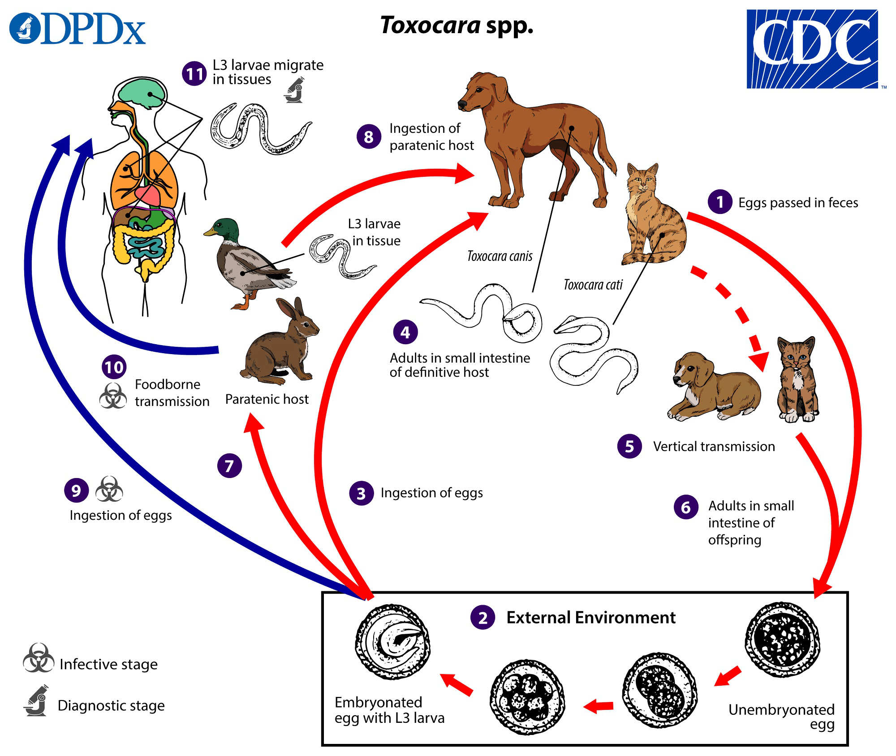
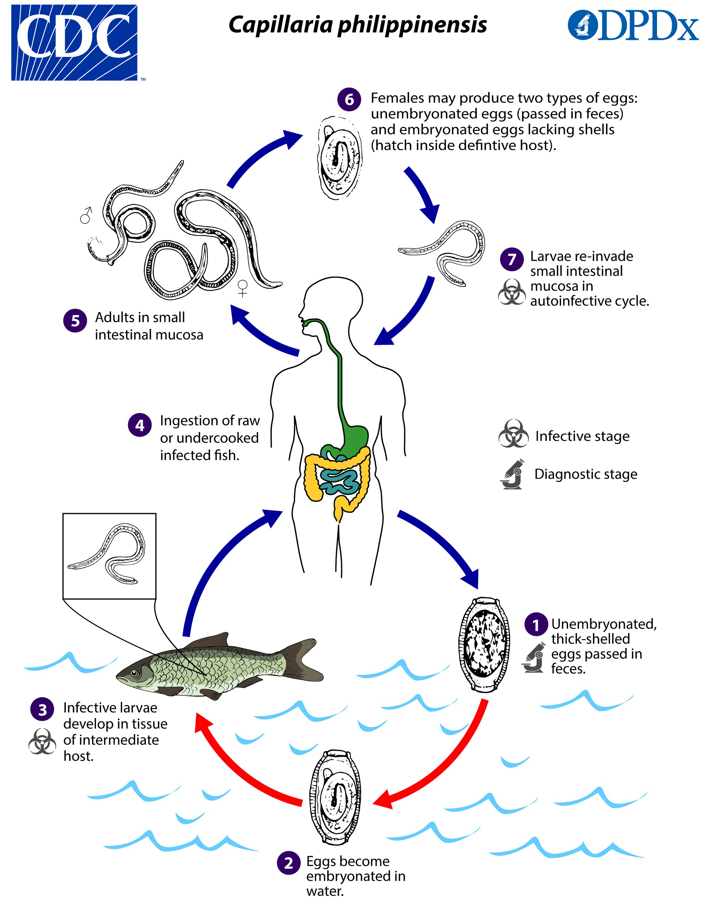
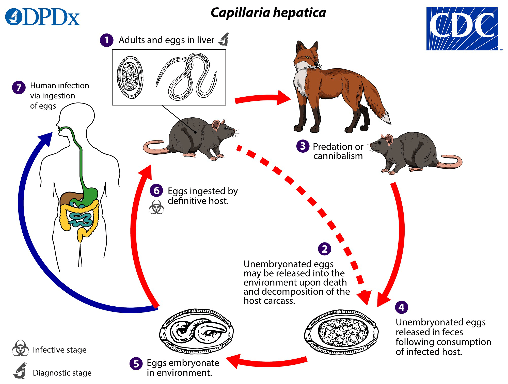
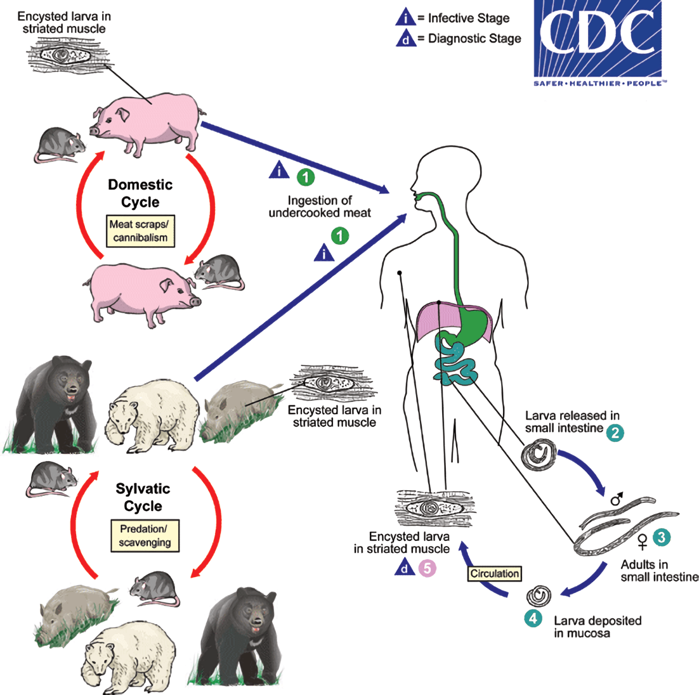
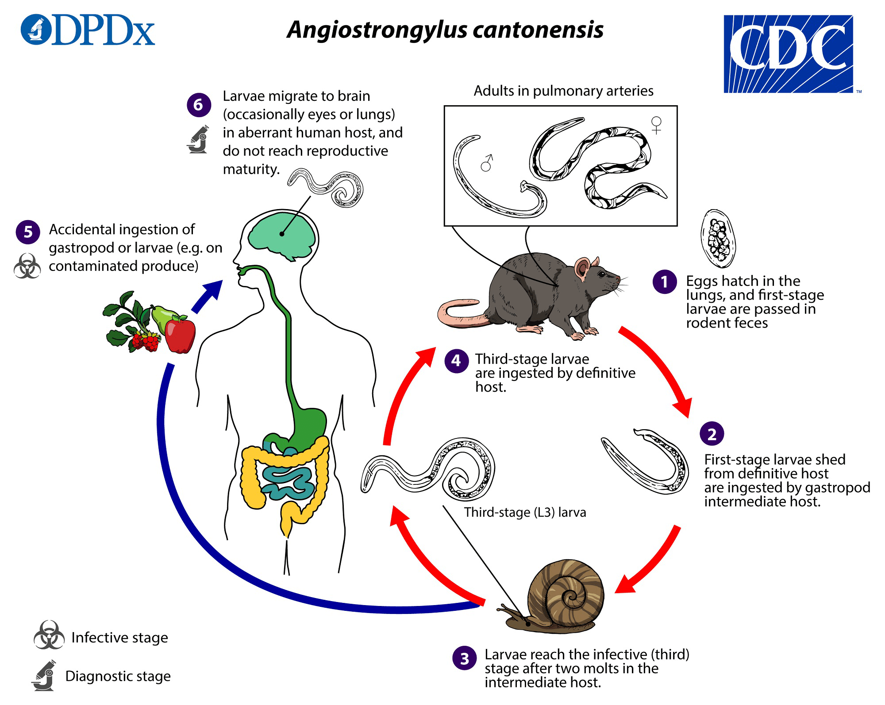
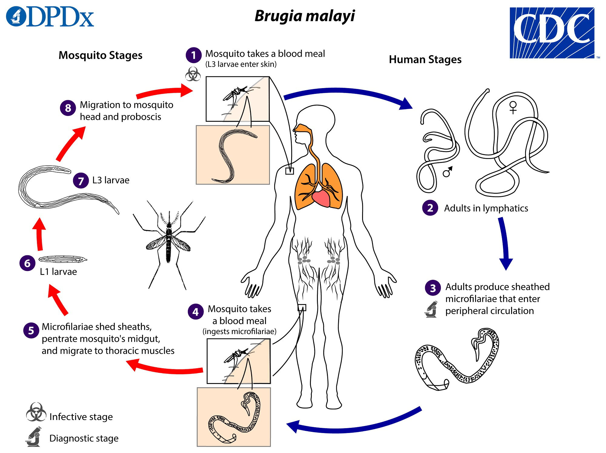
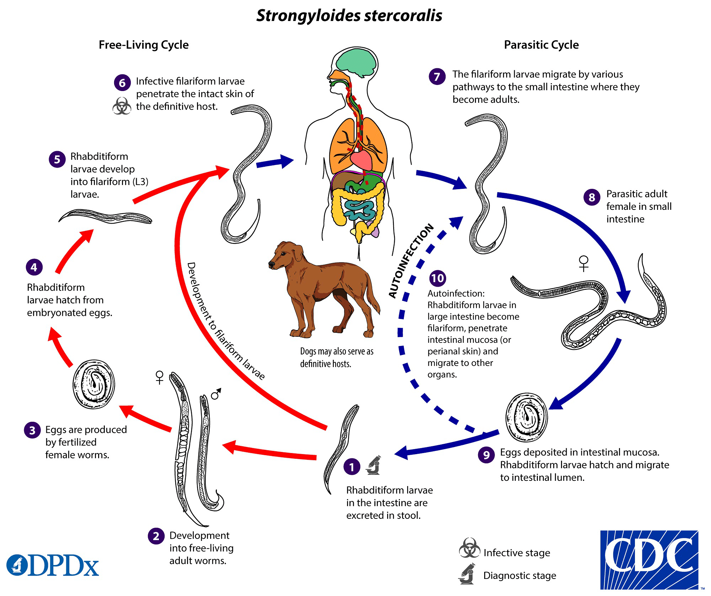

# 犬蛔蟲 *Toxocara canis*

屬於被忽視之人畜共通傳染疾病（NZDs, Neglected Zoonotic Diseases）

2014 年美國CDC 將犬蛔蟲列入五大本土寄生蟲病

## 感染

人類感染途徑：攝入蟲卵或被囊幼蟲

攝入受汙染之肉品如生食雞肉、兔肉、羊肉

## 生命週期
1. 狗攝入感染型蟲卵或攝入含被囊幼蟲 ( Encapsulated Larvae ) 之肉品
2. 犬蛔蟲於體內發育成蟲
3. 交配後產出蟲卵並於糞便中排出
4. 人類攝入蟲卵或被囊幼蟲
5. 犬蛔蟲以幼蟲狀態寄生在人體，穿過小腸黏膜後進入血液循環，
進入肝門靜脈後到達肝臟，再由肝臟往各器官移動

## 分布

全球皆有分布，熱帶、亞熱帶較多
//全球抗體陽性率

## 臨床症狀
四大症狀
- 內臟幼蟲移行症 ( Visceral Larva Migran )
- 眼部犬蛔蟲症 ( Ocular Larva Migran )
- 神經性犬蛔蟲症 ( Neural Larva Migran )
- 隱蔽性犬蛔蟲症 ( Covert Toxocariasis )

## 診斷

- IgG2 抗體偵測
- IgG4 抗體偵測：可提高辨識度
- TES-Western Blot：辨識度極高
- PCR

## 治療
Albendazole + 類固醇

---

# 菲律賓毛細線蟲 *Capillaria philippinensis*

## 感染

攝入含感染型幼蟲之淡海水魚類

感染過程不經過血液循環，到達腸道後繁衍

## 生命週期

1. 蟲卵經由人或鳥類進入環境
2. 被淡海水魚類攝食
3. 發育成感染型幼蟲，再被人或鳥類捕食

## 臨床症狀
常引發自體感染，容易變得非常嚴重

引起腹痛、腹瀉、蛋白質嚴重流失

嚴重至死亡

## 治療

Albendazole

## 診斷

患者糞便中可發現蟲卵，嚴重者可發現幼蟲及成蟲

//卵圖

---

# 肝毛細線蟲 *Capillaria hepatica*

## 感染

攝入土壤中之感染型蟲卵

## 生命週期

1. 大鼠攝入感染型蟲卵
2. 經由血液循環到達肝臟，停留發育
3. 成蟲於大鼠肝臟中交配、產卵，並造成肝臟纖維化、肝硬化 ( Hepatocirrhosis )
4. 於大鼠死亡後肝臟暴露，蟲卵進入土壤中

## 臨床症狀

- 急性或亞急性肝炎 ( Acute/Subacute Hepatitis )
- 嗜酸性球增多症 ( Eosinophilia )
- 肝實質 ( Liver Parenchyma ) 中會產出蟲卵，引發肉芽腫 ( Granulom ) 形成
- 蟲體也可能移動至其他臟器，嚴重者甚至會死亡

## 治療

## 診斷

於肝臟組織切片中發現成蟲及蟲卵

宿主的糞便中不會出現蟲卵，在糞便中發現的可能為攝入了遭寄生的宿主之肝臟消化後所留下的蟲卵

//蟲卵圖

---

# 住肉旋毛蟲 *Trichinella spiralis*

## 型態
F：2.2 mm
M：1.2 mm

## 感染

吃到未煮熟、受旋毛蟲感染的豬肉

## 生命週期

1. 被囊蚴 ( Encysted Larva ) 為其感染期，人類、豬隻或老鼠吃下含被囊蚴的肉而感染
2. 哺育細胞在小腸被消化液溶解，幼蟲釋出
3. 在小腸發育為成蟲並交配
4. 幼蟲穿過小腸黏膜，隨著血液循環跑到全身肌肉組織中
5. 形成被囊蚴需要約一個月時間

同種的 Trichinella pseudospiralis不會形成被囊蚴 不會形成被囊蚴
 
在被囊蚴階段的蟲體可活數年

人類：同時是中間宿主
與最終宿主

豬：同時是中間宿主和保蟲宿主

## 分布

盛行在全世界，尤其是歐美

## 臨床症狀

- 若感染量不多，不會有明顯症狀
- 蟲體在腸胃道時會伴隨腹瀉 、腹痛、嘔吐
- 幼蟲移行到周邊肌肉後 ( 大概是感染後一週 ) 會有:
  - 臉部水腫 ( Edema )
  - 肌痛 ( Myalgia )
  - 指甲下線狀出血 ( Splinter Hemorrhage )
  - 紅疹 ( Rash )
  - 嗜酸性球增多症 ( Eosinophilia )
- 幼蟲如果跑到心臟、肺或中樞神經會引起發炎，可能致命
- 形成被囊蚴約需一個月，期間可能感受到肌肉疼痛與肌肉衰弱的問題，被囊蚴成熟後症狀消失

## 治療
- Albendazole
- Mebendazole

## 診斷
- 抗體檢測
- 肌肉組織切片中的被囊蚴

---

# 廣東住血線蟲 *Angiostrongylus cantonensis*

## 別名：Rat lungworm

## 型態

- F：22~34 mm
- M：20~22 mm
- 雄蟲尾部有傘狀交尾刺
- 蟲體內靠近腸管有特殊構造 Lateral Cord ( LC )

## 感染

食用含有 L3 的中間宿主、保幼宿主 ( 爬蟲類、蝦蟹… ) 或受其汙染的食物而受感染

L3 幼蟲隨血液循環跑到腦部，但因人類並非其最終宿主，僅可發育成 L5幼蟲

## 生命週期

1. 成蟲寄生在大鼠肺動脈末端，產卵在肺動脈發育成 L1
2. 透過肺泡、氣管、咽喉到達腸道，最後隨糞便排出
3. L1幼蟲被中間宿主 ( 如蝸牛、蛞蝓 ) 吃掉，並在其體內長成具感染力的 L3 幼蟲，本階段幼蟲不會生殖或分裂，因此幼蟲數量在中間宿主體內維持不變
4. 大鼠捕食具幼蟲的中間宿主後，L3幼蟲從 其腸道跑到 CNS，約 2、3周發育為成蟲
5. 成蟲移動到蜘蛛膜下腔 ( Subarachnoid )，透過靜脈系統進入大鼠肺動脈並交配
6. 大鼠受感染後 40到 60天

宿主

中間宿主：陸地蝸牛 ( 非洲大蝸牛 )、水生蝸牛 ( 扁捲螺、福壽螺 )、蚯蚓、蝸牛
保幼宿主：螃蟹、青蛙、蝦子、人...等

## 分布

分布於亞洲、大洋美國夏威夷南非等地，也是台灣南部的本土疾病

## 臨床症狀

- 嗜酸性腦膜炎 ( Eosinophilic Meningitis )：幼蟲卡在腦部
- Ocular Invasion：幼蟲入侵眼睛
    - 多入侵 前眼房 ( Anterior Chamber )
- 嗜酸性球增多症 ( Eosinophilia )
- Pulmonary Involvement：幼蟲入侵肺部
    - 較少見

## 治療

國外一般教科書說觀察但不治療，或僅作症狀治療、使用抑制免疫的藥物；台灣經驗是會治療，用 Albendazole加上抗發炎藥物， 很有效

## 診斷
- 形態學
    - 讓病患側躺後正坐五分鐘再萃取 CSF，看到幼蟲的機會比較高
    - 可能在 CSF看到抗原體複合物形成的菱透明結晶 ( Charcot-Leyden Crystals )
- CSF液檢測：嗜酸性球大量增加 ( 20%～90% )、蛋白質增加、微量葡萄糖減少
- 血清檢測
  - 免疫螢光分析法 ( IF, Immunofluorescence Assay )
  - 酵素免疫分析法 ( EIA, Enzyme Immunoassay )
- 分子生物學：PCR

---
#  血絲蟲 Filaria

血絲蟲症 ( Filariasis ) 是血絲蟲 寄生在淋巴管 或皮下組織 ( Subcutaneous Tissue ) 所致之疾病

傳播媒介 ( vector ) 為節肢蟲 ( Arthropod-borne )

## 分類

<table>
<thead>
  <tr>
    <th>名稱</th>
    <th>學名</th>
    <th>寄生部位</th>
    <th>造成疾病</th>
    <th>傳播媒介</th>
    <th>分布</th>
  </tr>
</thead>
<tbody>
  <tr>
    <td>帝汶絲蟲</td>
    <td>Brugia timori</td>
    <td rowspan="3">淋巴管</td>
    <td rowspan="3">淋巴絲蟲病</td>
    <td>瘧蚊 Anopheles</td>
    <td></td>
  </tr>
  <tr>
    <td>馬來絲蟲 </td>
    <td>Brugia malayi</td>
    <td>斑蚊 Aedes 瘧蚊 曼蚊 Mansonia </td>
    <td>亞洲 </td>
  </tr>
  <tr>
    <td>班氏絲蟲 </td>
    <td>Wuchereria bancrofri</td>
    <td>家蚊 Culex 斑紋 曼蚊 瘧蚊</td>
    <td>熱帶地區</td>
  </tr>
  <tr>
    <td>蟠尾絲狀蟲 </td>
    <td>Onchocercan volvulus</td>
    <td rowspan="2">皮下組織 </td>
    <td>河川盲</td>
    <td>黑蠅 Simuliu</td>
    <td>非洲、中東、拉丁美洲</td>
  </tr>
  <tr>
    <td>羅阿絲蟲 </td>
    <td>Loa loa</td>
    <td></td>
    <td>虻 Chrysops</td>
    <td>非洲</td>
  </tr>
  <tr>
    <td>分瓣絲蟲</td>
    <td>Mansonella streptocerca</td>
    <td>真皮、皮下組織</td>
    <td></td>
    <td rowspan="2">蠓 Culicoides</td>
    <td>非洲</td>
  </tr>
  <tr>
    <td>棘唇絲蟲</td>
    <td>Mansonella perstans</td>
    <td rowspan="2">體腔</td>
    <td></td>
    <td>非洲、南美洲</td>
  </tr>
  <tr>
    <td>奧氏絲蟲 </td>
    <td>Mansonella ozzardi</td>
    <td></td>
    <td>蠓、黑蠅 </td>
    <td>美洲 </td>
  </tr>
</tbody>
</table>

## 型態

微絲蚴
- 外鞘：斑氏絲蟲、馬來絲蟲、羅阿絲蟲有
- 尾核
  - 有：羅阿絲蟲、 馬來絲蟲、 棘唇絲蟲、分瓣絲蟲
  - 無：斑氏絲蟲、奧氏絲蟲、蟠尾絲蟲

## 感染

接觸病媒

## 生命週期

1. 具傳染性的第三期幼蟲 ( L3 Larva ) 藉由蚊蟲叮咬進入人體，並隨著血液循環到寄居處
2. 雌雄交配後，產生微絲蚴 ( Microfilaria )，隨著血液循環流動
3. 蚊蟲叮咬時攝入人血裡的微絲蚴，在其體內形成 L3 幼蟲 ( 約 1~2 週 )並聚集在口腔
4. 再次叮咬人體時，會將 L3 幼蟲帶入人體內造成感染 ( 從幼蟲發育到成蟲約18個月 )

以馬來絲蟲為例

## 臨床症狀

- 初期感染沒有明顯症狀 ( Asymptomatic Filariasis )
- 急性期 ( Acute Stage ) 
  - 淋巴水腫 ( Lymphoedema )
  - 發燒 ( Filarial Fever )
  - 熱帶性肺部嗜酸白血球增多症 ( PTES, Pulmonary Tropical Eosinophilia Syndrome )
    - 呼吸窘迫、IgE濃度高、嗜酸性球增生 ( 微絲蚴漢城蟲皆會引發 )
    - 因微絲蚴常躲在肺部微小血管，採血時容易找不到，因生物特性夜晚較有機會發現
- 慢性期 ( Chronic Stage )
  - 象皮病 ( Elephantiasis )
    - 成蟲死亡堵塞 → 淋巴曲張 ( Varicose ) → 纖維母細胞增生 ( Fibroblast Hyperplasia ) → 纖維母細胞放出膠原蛋白 → 淋巴附近組織纖維化 → 血液循環受阻 → 水腫
    - 好發於下肢、陰囊 ( Scrotum )、乳房 ( Breast )、陰唇 ( Vulva )
  - 乳糜尿 ( Chyluria )：較少見
    - 班氏絲蟲較晚期的感染症狀
    - 乳糜池 ( Cisterna Chyli )下方淋巴結阻塞，造成腸道淋巴逆流入腎淋巴管系統，淋巴管破裂後造成腸道淋巴混流入集尿系統，在感染晚期乳白色液 ( 脂肪量較高 )
    - 尿液檢體剛開始看似正常，但隨著擺放時間越長逐漸轉成紅色及乳糜狀
    - 長期如此會因流失大量蛋白質、養分，造成貧血、低蛋白血症、體重減輕

## 治療

Diethylcarbamazine ( DEC ):
- 又稱海喘散 ( Hetrazan )，能夠殺死成蟲與微絲蚴
- 服用一天 2 mg/kg，持續 2～4 周
- 副作用：發生在嚴重感染者
  - 致命性腦炎 ( Fatal Encephalitis )
  - 腎臟病變（ Renal Lesion）

Ivermectin：殺死微絲蚴，用於治療淋巴性絲蟲病與河盲症

## 預防

- 避免蚊子叮咬與病媒防治
- 化學治療：預防性投藥 ( Prophylaxis ) DEC 300 mg/week
- Global Programme to Eliminate Lymphatic Filariasis ( GPELF )：計畫在風險地區大規模投藥 ( MDA, Mass Drug Administration ) 來根絕淋巴絲蟲，原本預定在2020完成，但實際上很難讓會員國都按照計畫行事，因此進度不如預期

## 診斷

形態學：檢測血液、尿陰、陰囊積液 ( Hydrocele Fluid )、組織切片中是否有微絲蚴的存在
- 血液抹片 ( Blood Smear )
  - 分為厚片 ( 10 μL )、薄片 ( 5 μL )
  - 絲蚴對於血絲蟲病人來說是重要的診斷期，但有些種的微絲蚴不會在血液中找到
    - Onchocerca volvulus → 皮膚
    - Mansonella streptocerca → 眼睛
- 血清學檢查 ( Serological Test )
- 血液濃縮 ( Blood Concentration Techniques )：比血液抹片更敏感，即使濃度低也能成功檢測
  - Knot Technique：利用福馬林沉澱
  - Nucleopore/Polycarbonate Filter Method：利用含有特殊孔洞的薄膜吸附蟲體 

抗原檢測 ( Antigen Detection )：檢測血液中絲蟲的抗原，目前可應用於斑氏絲蟲。由於微絲蚴血症 ( Microfilaremia )非常多變，此技術提供了一個有效的檢測方法

分子診斷 ( Molecular Diagnosis )：利用 PCR 定序，目前可檢測斑氏絲蟲、馬來絲蟲

抗體檢測 ( Antibody Detection )：不同寄生蟲容易交叉反應，專一性差；亦不能判斷感染時間點

---

# 羅阿絲蟲 Loa loa

## 簡介

- 又稱非洲眼蟲
- F:5~7 cm
- M:2~3.5 cm
- 成蟲形態：體核密度 高，具外鞘、尾核
流行病學：盛於非洲中西部，特別是森林與樹沼地區

## 傳播媒介：虻 Deer Fly / *Chrysops*
- 常出現的區域：溪流、沼澤、雨林
- 屬完全變態，在葉子背而產卵，孵化後幼蟲掉入土壤生長，發育為蛹，最後變為成蟲

## 臨床特徵

- Calabar Swelling：幼蟲在皮下移行刺激免疫反應造成紅腫。主要四肢，有時會跑到臉部
- 微絲蚴血症 ( Microfilaremia )：血液中含有微絲蚴
- 嗜酸性球增多症：數量上升
- Eye Worm：蟲體跑到眼睛，造成搔癢但不會失明
- Chronic Kidney Disease：極少數

## 診斷
- 因羅阿絲蟲為晝行性 ( Diurnal Periodicity )，白天取樣觀察是否有蟲體
- 觀察是否有 Calabar swelling
- 觀察結膜 ( Conjunctive ) 是否有蟲體
- Rapid Assessment Procedure for Loa loa ( RAPLOA )：問卷調查

---

# 蟠尾絲蟲 *Onchocerca volvulus*

## 簡介
- 第二常見的絲蟲感染
- M： 33～50 cm
- F： < 5 cm
- 流行病學：盛行於非洲、南美洲、葉門，其中的病例占全球 30％

## 傳播媒介：黑蠅 *Simulium* 
- 晝行性：白天出來吸血，而蟠尾絲蟲也同為晝行性
- 幼蟲孵化需要高含氧量，所以喜歡棲息在河川附近

## 臨床特徵
- 蟠尾皮膚炎 ( Onchoceral Dermatitis )
- 蟠尾氏瘤 ( Onchoceral Dermatitis )：
  - 皮下組織因為成蟲阻塞，形成結節，切開後可見蟲體
  - 好發部位因地區而異，中南美洲多在頸部以上，非洲則多在鼠蹊部的淋巴結和四肢
- 嗜酸性球增多症 ( Eosinophilia )
- 淋巴結腫大 ( Lyphadenopathy )
- Sowda ( Darkened skin）：很像淋巴絲蟲病，淋巴腫大造成慢性感染，使得黑色素沉澱、水腫、 角質化，並脫落壞死，稱為蜥蜴狀皮膚 ( Lizard skin )
- 角膜炎 ( Keratitis ) / 河盲症 ( River Blindness )
  - 微絲蚴蛋白質或共生菌 ( e.g. *Wolbachia* ) 引起的發炎反應
  - 角膜因為發炎反應變得混濁，需要動手術移植

## 診斷
- Skin Snips：直接將皮剪開檢查是否有微絲蚴
- Mazzotti Test：服用低劑量 DEC，如果有感染的話會引起過敏反應，比較不舒服、不人道
- Patch Test：原理同 Mazzotti Test，只是改成用羊皮沾 10% DEC，覆蓋在皮膚上，副作用較小
- Nodulectomy：較常用，將結節切開觀察是否有微絲蚴

## 治療
Ivermectin
- 已開始出現抗藥性
- 只對微絲蚴有效
DEC
用手術物理清除蟲體

---

羅阿絲蟲與蟠尾的共同感染 ( Co-infection )
- 兩者在非洲的盛行區域重疊
- 同時感染多種寄生蟲，要注意 Ivermectin 劑量，否則可能會產生致命性的嚴重發炎反應

---

# 糞小桿線蟲 *Strongyloides stercoralis*

與福氏桿線蟲 ( *Strongyloides fülleborni* ) 同屬，會感染黑猩猩及狒狒，也有可能感染人類

## 生命週期
非寄生生命週期：Free-living
1. 幼蟲為桿狀幼蟲 ( Rhabditiform Larvae )，可在宿主糞便中發現
2. 蛻皮 ( Molt ) 兩次後發育成感染型幼蟲 / 絲狀幼蟲 ( Filariform Larvae )，或蛻皮四次後發育成非寄生型成蟲
3. 非寄生型成蟲產下的卵會一樣出桿狀幼蟲，同樣可以發育成感染型或非寄生
4. 感染型幼蟲 ( Filariform Larvae ) 會穿透人的皮膚開始其寄生生命週期

寄生生命週期 ( Parasitic Cycle )
1. 絲狀幼蟲穿透皮膚， 經血液循環到肺臟，穿透肺泡經呼吸道上行至咽喉，從消化道到達小腸
2. 絲狀幼蟲在小腸蛻皮兩次發育成寄生型雌性蟲，行孤雌生殖產卵，孵化出桿狀幼蟲
3. 卵孵化為桿狀幼蟲後，有兩種可能
  1. 隨糞便排出，開始新的生命週期
  2. 自體感染 ( Autoinfection )
    1. 內部的自體感染 ( Internal Autoinfection )：先發育為絲狀幼蟲，直接穿透小腸黏膜
    2. 外部的自體感染 ( External Autoinfection )：透過糞便沾染原宿主肛門周邊區域穿透皮膚

糞小桿線蟲的性別分為三種：非寄生型雌、雄和寄生型雌性

目前在人類的蠕蟲感染中，只有糞小桿線蟲 ( *Strongyloides stercoralis* ) 和菲律賓毛細線蟲 ( *Capillaria philippinensis* ) 有被觀察到自體感染的現象

## 分布

熱帶及亞熱帶地區，但也有案例出現在溫帶地區，如美國的南部地區

## 臨床症狀

急性：於幼蟲入侵肺部後數天內發生
1. 心肺
- 氣管：咳嗽、氣管刺激 ( Tracheal Irritation )、Mimicking Bronchitis、咳血 ( Hemoptysis )
- 呼吸：呼吸困難 ( Dyspnea )、呼吸衰竭 ( 極少出現 )、呼吸性鹼中毒 ( 常見 )
- 其他：心房顫動 ( Atrial Fibrillation )、Loeffler’s Syndrome ( 肺部嗜酸性球增多 )
2. 腸胃道
- 包含腹痛、腹瀉、便祕、厭食症 ( Anorexia )
- 感染約兩週後出現，三至四週後可於糞便發現蟲卵

慢性：通常無症狀
1. 腸胃道症狀為間歇性嘔吐、便祕、腹瀉
2. 肛門搔癢症、 蕁麻疹、Larva Currens Rashes 等皮膚症狀也很常見
3. 復發性的氣喘和腎臟症狀也跟此有關聯

高度感染 ( Hyperinfection )
1. 自體感染加速造成，通常會造成免疫系統狀況的改變
2. 遷徙幼蟲數量上升會造成腸胃和肺部症狀惡化
3. 糞便中幼蟲數上升是重要判斷指標
4. 可能造成蛋白質流失腸病變 ( PLE, Protein-losing enteropathy )
5. 絲狀幼蟲可散佈到許多組織和實體器官 ( 肺、腦膜空間和大腦、淋巴結、心內膜、胰腺、肝臟、腎臟、皮膚和皮下組織 )
6. 通過破壞微血管引起出血，絲狀幼蟲也引起強烈發炎反應，並可能允許其他感染性生物進入 ( 主要是革蘭氏陰性細菌 ) 侵入部位

瀰漫性糞小桿線蟲症 ( Disseminated Strongyloidiasis )
1. 發生在免疫缺乏的患者中
2. 伴有腹痛、膨脹、休克、肺和神經系統並發症以及敗血病 ( Septicemia )，並可能致命

## 診斷

幼蟲常以桿狀 ( Rhabditiform ) 或絲狀 ( Filariform ) 出現在糞便或十二指腸液

- 糞便檢測 ( Stool Examination )：直接抹片法 ( Wet Mount Examination )
  1. 用 Formalin-ethyl Acetate濃縮萃取
  2. 以 Baermann Funnel Technique取得蟲卵
  3. HaradaMori Filter Paper Technique培養
  4. 最後在Agar培養並觀察
  5. ※單次抹片檢測相對不精準，常需要做很多次
- 十二指腸液 ( Duodenal Fluid Examination )：Enterotest string 或 Duodenal Aspiration 以分析十二指腸液檢查蟲卵
- 痰液 ( Sputum )：在感染 Disseminated Strongyloidasis的患者痰液內有可能發現蟲卵

## 治療
- Ivermecin ( 首選 )
- Thiabendazole

