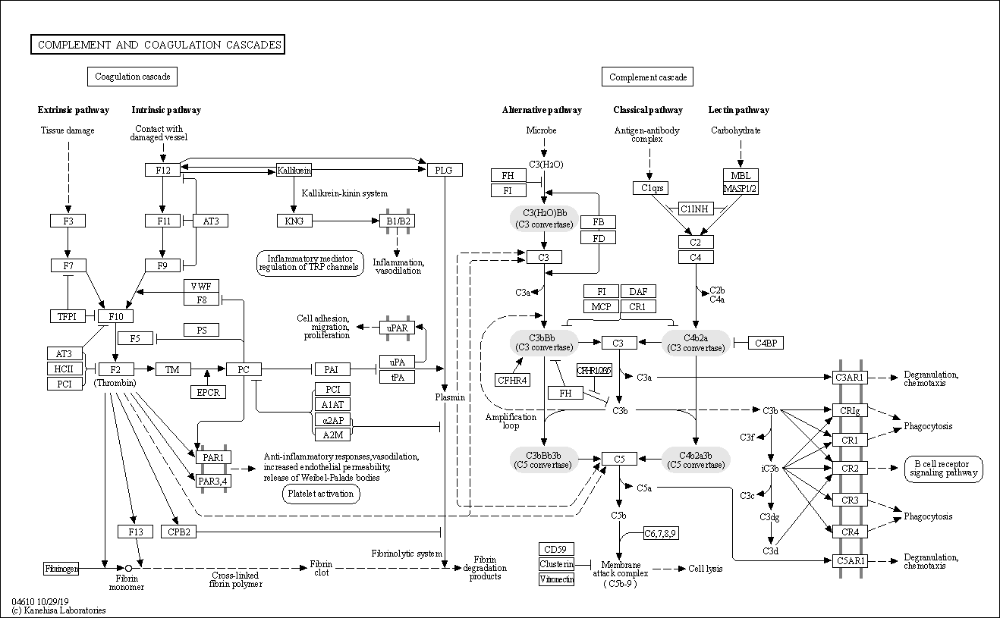

# Innate Immunity

最初的防禦機制，可以避免感染 ( 如皮膚阻隔 )，也可以消除微生物 ( 如吞噬細胞、補體、NK )

時程上早於由淋巴細胞等主導的適應性免疫 ( Adaptive Immunity )

## 發炎

急性發炎 ( Acute Inflammation )
- 身體為了消滅病原體且回復組織功能的反應
- 受感染區域
  - 血流量增加
  - 微血管通透性增加
  - 大量白血球聚集：較多嗜中性球與活化的輔助T 細胞

慢性發炎 ( Chronic Inflammation )
- 若無法完全清除病原體，使得身體不斷受抗原刺激或病原體的細胞毒素影響，將造成慢性發炎
- 該處會有較多巨噬細胞、胞毒 T 細胞甚至 B 細胞的出現

---
## 細胞的移動
白血球的移動模式由循環中的白血球與血管上皮的互動決定，且被內皮表面表現的黏附分子 ( Adhesion Molecules ) 和趨化激素 ( Chemokines ) 調控

白血球移動的調控點通常在小靜脈之中，原因如下
1. 訊號分子及黏附分子通常在小靜脈內皮細胞上表現
2. 血流造成的剪力 ( Hemodynamic Shear )在小靜脈中較小，細胞能有更充分的時間反應
3. 小靜脈中的內皮細胞之表面電荷分布較少，可減少排斥力

移動過程分為三部分：牽引 ( Tethering )、誘導 ( Trggering )、黏著 ( Adhesion )

### 牽引 Tethering

白血球上的 CD15 受到內皮上的細胞黏附分子E-selectin 吸引後減速，在細胞表層滾動前進

參與分子：Selectin
- P-selectin：血小板與內皮細胞分泌，和血小板、內皮細胞、嗜中性球連接
- E-selectin：內皮細胞分泌，和白血球連接
- L-selectin：部分白血球分泌，和內皮細胞、高內皮小靜脈 ( HEV ) 連接

### 誘導 Triggering

白血球減速後有機會和內皮表面的信號作用，特定趨化激素和有相應受體的白血球結合

參與分子：趨化激素 ( hemokine )
- 有兩個結合位，其一是用來和白血球之受體結合，其二是和蛋白聚糖 ( Proteoglycans ) 結合，使其可附著在內皮細胞表面或是飄在血管中
- 由受傷組織的內皮細胞製造，或原本儲存在內質網中被釋放出來
- 不同趨化激素有其特定受體，而不同白血球也會表現不同受體

### 黏著 Latching

白血球被趨化激素 ( hemokine ) 活化後，整聯蛋白 ( Integrin ) 親和性增加，連接內皮上的細胞黏附分子 ( AM, Cell-adhesion Molecule )，使白血球能穿過血管壁至組織中清除致病原

參與分子：
1. 整聯蛋白 ( Integrin )
- 由α 和β 兩部分組成的二聚體
- 受到刺激後會接在細胞骨架 ( Cytoskeleton ) 上從胞內移出胞外，並產生構型改變被活化
- 與CAM 的結合有專一性
- 整聯蛋白名稱的全名
  - VLA：Very Late Antigen
  - VCAM：Vascular Cell Adhesion Molecule
  - LFA：Leukocyte Functional Antigen
  - ICAM：Intercellular Adhesion Molecule

2. 內皮的黏附分子 ( Adhesion Molecule )
- 表現在內皮細胞上的免疫球蛋白超家族 ( Immunoglobulin Supergene Family )，能與不只一種相應的整聯蛋白 ( Integrin ) 結合
- 有些CAM 原本在胞內，經過促炎性細胞激素 ( Inflammatory Cytokine )如IL-1、TNF-α 的誘導後才會在膜上表現，如ICAM-1、VCAM-1；有些則持續表現於膜上，如ICAM-2

---

# 補體系統 Complement System

## 調理作用 Opsonization

補體 C3b、C4b 與病原體結合，使吞噬細胞更容易吞噬該病原體

## 趨化作用 Chemotaxis

1. 補體於病原體位置聚集，吸引吞噬細胞往補體濃度高處靠近，使其更容易吞噬病原體
2. 補體裂解後，體積變小而更容易從製造處擴散，以結合上吞噬細胞的對應受體
   - C3a 是C3 的蛋白質片段，對應到吞噬細胞上的C3aR
   - C5a 是C5 的蛋白質片段，對應到吞噬細胞上的C5aR

## 溶解作用 Lysis

分為古典 ( Classical )、凝集素 ( Lectin )、替代 ( Alternative ) 三種途徑，**最終形成C5b-9，即 MAC ( Membrane Attack Complex ) 溶解目標細胞膜**

### 古典途徑 Classical Pathway

觸發：Antigen ( Ag ) 或 Ag-Ab ( IgM,IgG1-3 )

C1q的球球抓到抗原或抗原抗體結合物，使C1r、C1s 相繼活化，一直反應下去，最終產生C4(b2a)

PS. (b2a)表b2a活化 想不到方式表示比較好

**C4(b2a) C3 轉化酶，加上C3b則是 C5 轉化酶 重要**

再經過幾步形成C5b67，加上C8、C9，形成C5b-9

### 凝集素途徑 Lectin Pathway

觸發：MBL ( Mannos-binding lectin ) -> mannose 抓到致病體表面的醣 ( Ag ) -> ( MASP-1,MASP-2 ) x 2

之後流程與古典無異

### 替代途徑 Alternative Pathway

- C3在自然路徑下就會有點水解，形成C3(H2O)
- C3(H2O)會跟因子B(Factor B)結合
- 因子D第一次過來，把B切成Bb(留下)和Ba(丟掉)
- C3(H2O)Bb複合體形成，也就是本路徑的C3轉化酶
- C3被切割成更多的C3b(留下)和C3a(丟掉)
- C3b與因子B結合
- 因子D第二次過來，把B切成Bb(留下)和Ba(丟掉)，形成C3bBb，也是C3轉化酶
- 旁邊的其他C3b再過來，產生C(3b)2Bb複合體，也就是這個路徑的C5轉換酶
- 之後流程與古典無異

---

