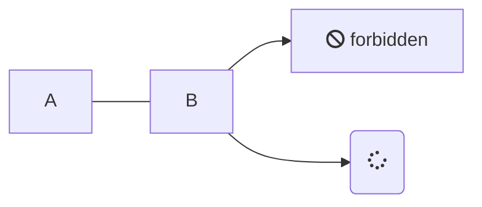

> [!NOTE]
> 測試.

> [!TIP]
> 測試 為甚麼這樣不行呢

> [!TIP]
> An alert of type 'tip' using global style 'callout'.

> [!WARNING]
> 這是個警告 .

> [!ATTENTION]
> 這是個注意

> [!NOTE|style:flat]
> 測試結果 記得加個空格然後後面再接任何一個東西才會顯示" ."這樣最方便

